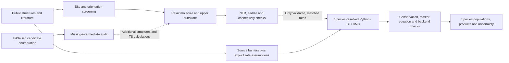
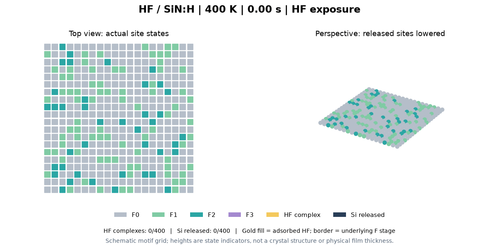
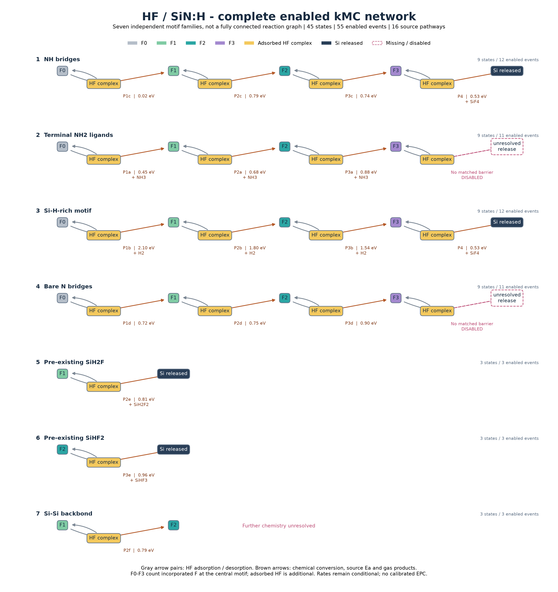
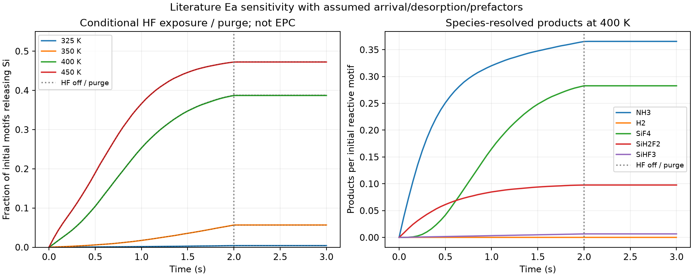
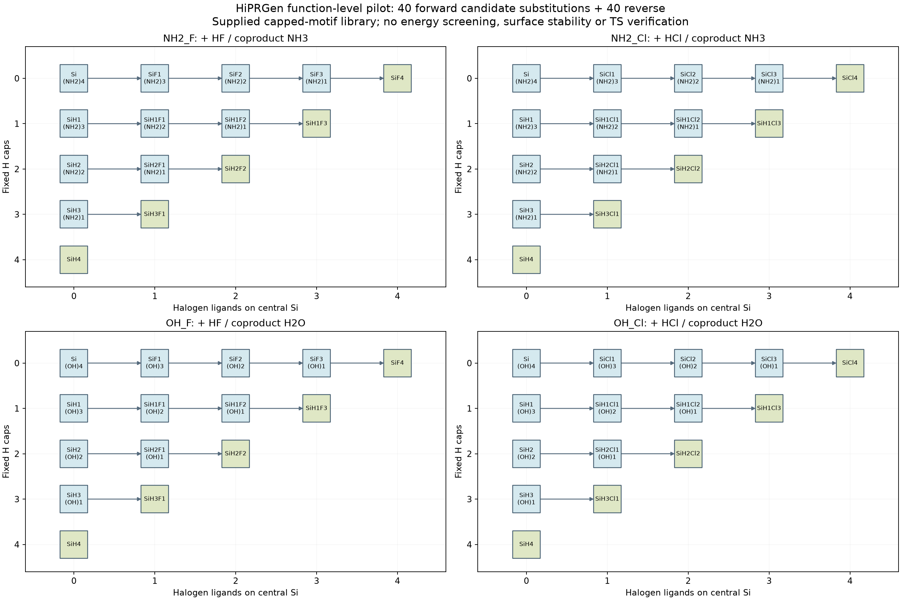
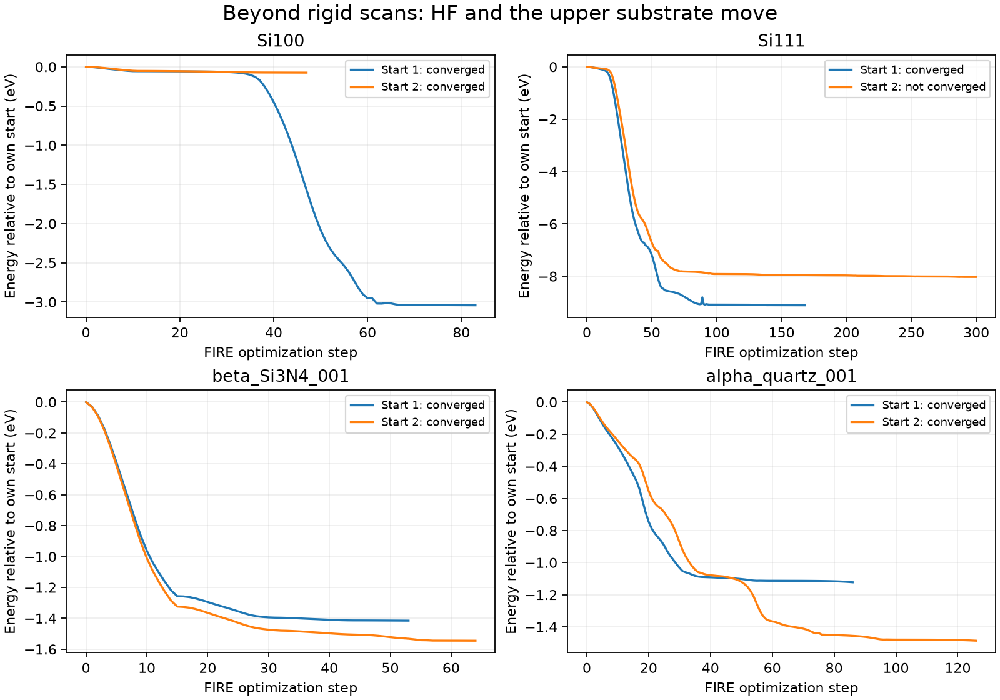
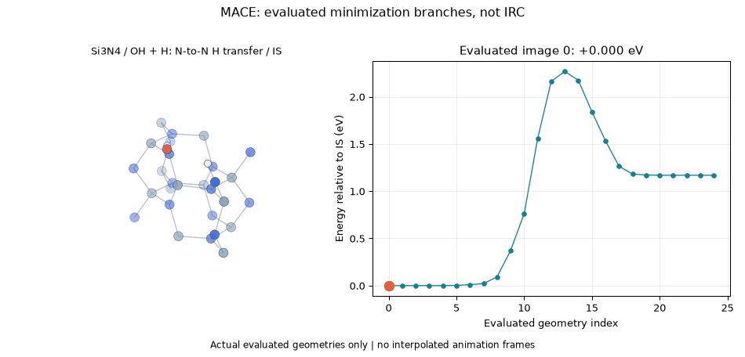
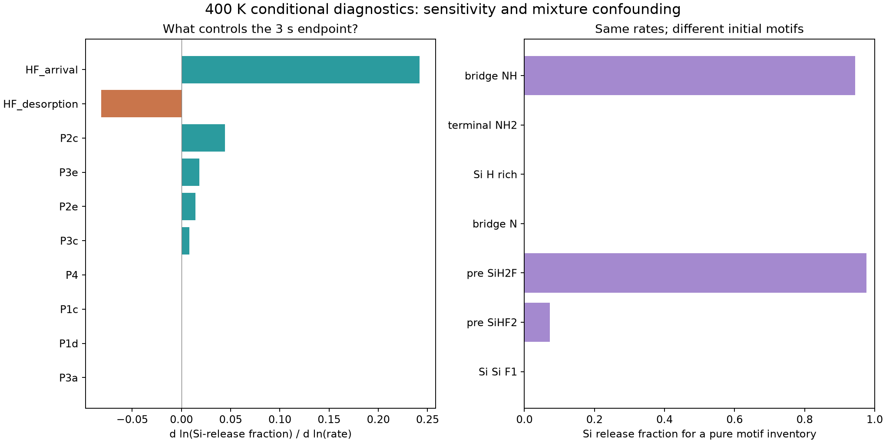

# Plasma Surface Dynamics

**Physics-based and machine-learning workflows for silicon and silicon-nitride atomic layer etching.**

Combining surface reaction kinetics, Python/C++ simulation, public atomistic data, and pretrained MACE force-field comparisons.

**Research question:** How do surface modification, competing removal pathways, and uncertain reaction rates determine etch-per-cycle saturation and the usable ALE energy window?

[Status](#current-status) | [Workflow](#research-workflow) | [kMC animation](#species-resolved-kmc) | [Reaction network](#complete-kmc-network) | [Atomistic results](#beyond-rigid-approach-scans) | [Run locally](#run-locally)

## Current status

<!-- BEGIN CURRENT STATUS -->
| Component | Current status |
|---|---|
| Numerical checks | **66 tests passed**; atom conservation, independent master equation, Python/C++ statistical agreement and artifact provenance. |
| Species-resolved kMC | **45 states / 55 enabled events**, 16 source pathways; **512 C++ trajectories** across 325-450 K. Conditional kinetics, not calibrated ALE. |
| Network discovery | HiPRGen pilot: **40 forward + 40 reverse candidates**, with missing-intermediate audit; no automatic rate assignment. |
| Atomistic evidence | MACE surface paths and molecular screening; OMol25 local models and direct DFT diagnostics. Convergence limits retained. |
| Beyond rigid scans | **7/8 HF/substrate relaxations force-converged**, two starts on each of four surfaces; see reference convergence below. |
<!-- END CURRENT STATUS -->

**Evidence boundary:** numerical verification is not experimental validation. The species model uses literature activation energies with assumed arrival/desorption rates, prefactors and initial populations. It does not yet predict calibrated etch per cycle (EPC), arbitrary Si:N composition effects, or a complete plasma mechanism. Unconverged atomistic peaks are excluded from its rates.

## Research workflow



The current kMC rates come from the literature branch. Newly screened or relaxed geometries do not automatically become kinetic parameters. The [parameter audit](docs/DRY_ETCH_PARAMETERS.md) and [HiPRGen audit](docs/HIPRGEN.md) identify what is supported and what still needs calculation.

## Species-resolved kMC



**Read the colors:** gray = F0, green = F1, teal = F2, purple = F3, gold = adsorbed HF complex, dark blue = Si released. F0-F3 denote incorporated fluorination stage; gold is additional HF occupancy, with the underlying stage shown by its border in the top view. These colors match the network below.

**Why one layer?** This model follows 400 initial reactive motifs through one HF dose and purge. A Si-release event leaves a residual state; it does not reveal and initialize a fresh subsurface motif. The perspective height only distinguishes retained and released Si. It is a schematic state map, not an atomistic crystal or physical film thickness. Multilayer recession needs explicit subsurface connectivity, exposure rules, new-site chemistry and corresponding rates; those are not yet implemented here.

Every frame is a saved stochastic trajectory snapshot, with no interpolated states. [Trajectory and frame provenance](docs/species_kmc_results/animation_manifest.json). The temperature ensemble separately uses 1,000 motifs and 128 replicates per temperature.

## Complete kMC network



**The complexity is structured:** seven independent motif families contain 45 named states and 55 enabled events. They share gas reservoirs but do not interconvert in this model. All 16 source pathway entries are represented. Gray arrow pairs are HF adsorption/desorption; brown arrows show chemical conversion, source activation energy and released gas; dashed pink steps lack matching barriers and are disabled. Two proposed residual states remain unreachable.

The figure is generated directly from the [state/event configuration](configs/species_kmc_network.json), not drawn as a speculative fully connected mechanism. [Zoomable SVG](docs/reaction_network/species_kmc_network.svg) | [Simple reading guide](docs/reaction_network/species_kmc_overview.png) | [All event rates and source IDs](docs/species_kmc_results/event_rates.csv).



[Full kMC results, equations and validation](docs/species_kmc_results/REPORT.md) | [Intermediate populations](docs/species_kmc_results/intermediate_populations.png) | [Rate-assumption sensitivity](docs/species_kmc_results/assumption_sensitivity.csv).

<details>
<summary>Broader candidate network: HiPRGen and missing chemistry</summary>



The function-level HiPRGen pilot retains 40 forward and 40 reverse substitutions for capped Si-N/Si-O motifs with F/Cl. These are candidates, not verified surface reactions or assigned rates. [Execution scope](docs/HIPRGEN.md) | [Missing intermediates](data/reaction_network/intermediate_gaps.csv) | [Fragments and experimental discrimination](docs/REACTION_CANDIDATES.md).

</details>

## Beyond rigid approach scans

Rigid scans screen possible starting sites and orientations; they cannot establish relaxed adsorption, transition states or reaction rates. The next stage relaxes both HF and the upper substrate from two distinct site/orientation starts on each of Si(100), Si(111), beta-Si3N4(001) and alpha-quartz(001), with the lower substrate fixed. Convergence and remaining constraints are reported explicitly.

<!-- BEGIN RELAXATION STATUS -->
**7/8 adsorbate/substrate relaxations meet 0.04 eV/angstrom.** Lower-half atoms remain fixed. Force convergence does not establish a stable minimum or transition state. [Full table, energy traces and actual relaxation GIFs](docs/dry_etch_results/RELAXED_ADSORPTION.md).


<!-- END RELAXATION STATUS -->

| Evidence | Result and interpretation |
|---|---|
| Site/orientation screen | 9 molecules x 4 surfaces; 288 curves / 2,592 evaluated geometries, plus 324 baseline geometries. A starting-point inventory, not TS evidence. |
| Surface diffusion paths | Three constrained MACE F/Cl migration NEBs with recorded energies and checks; see [surface paths](data/surface_paths/README.md). |
| Water-derived surface saddle | N-to-N H transfer beside Si-OH on constrained nitride: 2.2683 eV above the connected local IS. Not water dissociation or Si removal. |
| Local Si-N/Si-O cleavage | OMol25 molecular paths remain unconverged. PBE/def2-SVP single points are diagnostic; one Si-O image has an unresolved SCF root and is excluded. No new DFT etch barrier is claimed. |



[All molecular systems, energy tables, equations and hypotheses](docs/dry_etch_results/MOLECULAR_SURFACES.md) | [DFT/TS report](docs/dry_etch_results/TRANSITION_STATES.md) | [Literature and AIMD support](docs/LITERATURE.md).

## What the new checks reveal

This is **not yet publication-ready predictive ALE**. The [critical scientific review](docs/SCIENTIFIC_REVIEW.md) compares independent chemical, experimental and modeling sources and sets specific acceptance criteria.

- **Flux and initial surface state matter:** at 400 K, HF arrival is more influential than any individual enabled chemical-rate group; the assumed motif mixture strongly controls Si release.
- **Relaxation alone is insufficient:** clean-slab reference bias dominates some apparent Si/HF adsorption energies. Those values are excluded from quantitative binding claims and kinetic parameters.
- **A plateau is not automatically ALE:** the current graph has a 60% eventual removal ceiling imposed by its initial mixture and missing release paths. Multilayer exposure, coadsorption and product retention need explicit models and evidence.



The next focused objective is to distinguish fluorination from volatile removal on a specified SiNx:H surface, with matched fluxes and competing retained-product states. [Literature evidence map](data/literature/research_evidence_map.json) | [Independent coadsorbate-rate comparison](docs/SCIENTIFIC_REVIEW.md#4-quantify-why-coadsorbate-identity-matters).

## Run locally

Python 3.11+ and a local CPU are sufficient for kMC. From a checkout:

```powershell
python -m venv .venv
.venv\Scripts\Activate.ps1
python -m pip install -e ".[dev]"
python scripts/build_species_cpp.py
python scripts/run_species_kmc.py
python scripts/plot_reaction_networks.py
python scripts/report_species_kmc.py
python scripts/analyze_kinetic_priorities.py
python scripts/compare_literature_channels.py
python scripts/update_research_readme.py
python -m pytest -q
```

On Linux/macOS, activate with `source .venv/bin/activate`. The optional C++ backend needs a C++17 compiler. Atomistic calculations require a separate [MACE environment and model](docs/MACE.md); run `python scripts/relax_adsorption_multistart.py`, `python scripts/audit_adsorption_references.py`, and `python scripts/report_relaxed_adsorption.py` there. Model weights are not bundled.

## Further documentation

| Topic | Reference |
|---|---|
| Python/C++ species solver and assumptions | [kMC report](docs/species_kmc_results/REPORT.md), [Python](plasma_surface/species_kmc.py), [C++](cpp/species.cpp) |
| Public structures, datasets and licensing | [Datasets](docs/DATASETS.md), [MACE comparisons](docs/MACE.md) |
| Original synthetic ALE and composition demonstrations | [Extended results and animation gallery](docs/PROJECT_DETAILS.md), [model equations](docs/MODEL.md), [usage](docs/USAGE.md) |
| Research gaps and experiment planning | [Intermediate gaps](data/reaction_network/intermediate_gaps.csv), [reaction candidates](docs/REACTION_CANDIDATES.md), [research plan](docs/RESEARCH_PLAN.md) |

The original Si/SiNx material cards remain hypothetical sensitivity scenarios; their thickness conversion and generic deposition channel are illustrative. Public measurements are used only within their documented scope; experimental calibration data are not fabricated.
