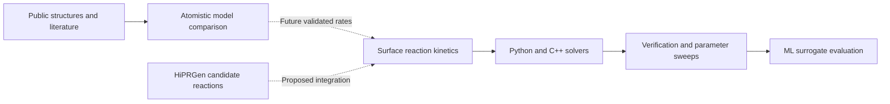

# Plasma Surface Dynamics

**Physics-based and machine-learning workflows for silicon and silicon-nitride atomic layer etching.**

A research software portfolio by [Ryan](https://github.com/ryanlai666), combining surface reaction kinetics, Python/C++ simulation, public atomistic data, and pretrained MACE force-field comparisons. Runs on a local CPU; a GPU or cluster is not required for the included demonstrations.

**Research question:** How do surface modification, competing removal pathways, and uncertain reaction rates determine etch-per-cycle saturation and the usable ALE energy window?

> **Scientific scope:** This project verifies numerical implementations and compares atomistic models. Default ALE rates are uncalibrated, and SiNx composition cards are hypothetical sensitivity scenarios. The results do not establish experimental etching accuracy.

## Demonstrations

### Silicon ALE: reaction kinetics across repeated cycles


The left panel compares exact mean-field integration with a stochastic Gillespie simulation. The right panel shows the illustrative model's energy dependence at different modification durations. Coverage carries across process phases and cycles.

```powershell
python scripts/build_cpp.py
python -m plasma_surface.cli demo --backend cpp
```

### Silicon nitride: explore assumptions and atomistic model disagreement


MACE-MP-0b2 small and MACE-MPA-0 medium are evaluated on diamond Si, a public beta-Si3N4 crystal, and two unrelaxed nitrogen-vacancy probes. Energies are referenced separately within each composition. These are structural comparisons, not predicted etch rates or an accuracy ranking.

[Atomistic comparison report](docs/mace_results/REPORT.md) ? [MACE setup](docs/MACE.md) ? [Hypothetical Si/SiNx kinetics comparison](docs/results/materials/comparison.png)

### Numerical validation and saturation


The stochastic ensemble scatter decreases with increasing site count. The dose sweep checks saturation within the chosen illustrative mechanism.

## Recorded results

| Check or comparison | Recorded result | Interpretation |
|---|---:|---|
| Regression suite | 19 tests passed | Analytical limits, kinetics, calibration recovery, and backend checks |
| Python/C++ recipe comparison | 4,096 recipes | Same deterministic model evaluated by both implementations |
| Maximum backend EPC difference | 2.22e-16 nm/cycle | Numerical agreement |
| Stochastic ensembles | 6 of 6 within five standard errors | Agreement with the exact mean-field expectation |
| Synthetic surrogate held-out MAE | 0.00284 nm/cycle | Approximation of the uncalibrated model |
| Constant-baseline MAE | 0.05223 nm/cycle | Reference for the synthetic surrogate |
| MACE structural evaluations | 24 across two checkpoints | 12 structures evaluated by each model |
| MACE energy/force consistency | Both checks passed | Finite-difference tolerance: 1e-4 eV/angstrom |
| Public Si-HCl DFT geometry inventory | 22 structures | Provenance and checksums retained |

[Full simulation report](docs/results/REPORT.md) ? [Raw benchmark timings](docs/results/benchmark.json) ? [Research roadmap](docs/RESEARCH_PLAN.md)

The C++ kMC backend uses constant-time eligible-site selection. The recorded 2,048-site, 10-cycle benchmark had median times of 2.64048 s in Python and 0.002218 s in C++. This workload-specific comparison includes the algorithm change as well as compilation; timings vary with machine load and do not imply a universal speedup.

## Modeling workflow



Solid arrows describe implemented workflows; dashed arrows require further reaction data and model development. [HiPRGen assessment](docs/HIPRGEN.md).

## Run locally

Python 3.11+; no GPU, paid data service, or cluster required. From this directory:

```powershell
python -m venv .venv
.venv\Scripts\python -m pip install -e ".[dev]"
.venv\Scripts\python -m plasma_surface.cli demo
```

If your active Python already has NumPy, SciPy, scikit-learn, Matplotlib, and pytest:

```powershell
python -m plasma_surface.cli demo
python -m pytest -q --basetemp=outputs/pytest-run
```

`outputs/demo/` contains phase-resolved mean-field and kMC results, a 128-recipe synthetic campaign, held-out ML predictions, metrics, a figure, and a provenance manifest.

## C++ acceleration

A C++17 GCC/Clang compiler is optional. The current Windows machine has MSYS2 GCC. Build locally; no Python binding package is needed:

```powershell
python scripts/build_cpp.py
python -m plasma_surface.cli demo --backend cpp --output outputs/demo_cpp
python -m plasma_surface.cli benchmark
python -m pytest -q --basetemp=outputs/pytest-cpp
```

The C++ library implements both exact mean-field integration and continuous-time Gillespie kMC. A permutation partition enables constant-time selection of bare or modified sites. Python's reference kMC scans site arrays, so the measured improvement includes both compilation and an improved selection algorithm. Python still handles rate construction, analysis, plotting, and ML.

Benchmark results are saved to `outputs/benchmark.json`, including workload, repeat timings, event counts, compiler options, and source/binary hashes. Stochastic trajectories differ between backends; agreement is statistical. C++ mean-field outputs are checked against Python to numerical precision. Small mean-field problems may not speed up because binding overhead dominates. Linux/macOS builds are supported by the script but have not been run on this machine. The backend is designed for a source checkout/editable install; a portable binary wheel is not provided.

## Silicon and silicon nitride

```powershell
python -m plasma_surface.cli materials --backend cpp
```

This compares Si, SiN₀.₈, SiN₁.₀, and Si₃N₄ tags using explicit parameter cards in [configs/materials.json](configs/materials.json). Here x=N/Si; stoichiometric Si₃N₄ has x=4/3. Outputs include a comparison figure, CSV, and all effective parameters.

**Composition is metadata in this first version, not an evolving surface state.** Differences between curves come from the chosen hypothetical rates. Hydrogen fraction is recorded but does not drive kinetics. The generic phase sequence is not a validated nitride etch chemistry. The Si thickness conversion is also inherited in these exploratory cards; real SiNₓ calibration must replace it. Preferential N removal, composition enrichment, hydrogen chemistry, film density, and product speciation require a richer reaction network. See the [research plan](docs/RESEARCH_PLAN.md).

## Public data

```powershell
python -m plasma_surface.cli fetch-data
```

The verified public [Si–HCl DFT archive](https://zenodo.org/records/10211009) is ~75 kB and licensed CC BY 4.0. The downloader preserves attribution, source metadata, and checksums; inventory reads the ZIP without extraction. The recorded run inventoried 22 structures; use the download command to recreate `data/raw/si_hcl/` locally. These geometries do not provide a calibrated chlorine/argon ALE model.

For SiNₓ, the [SAIT MLFF benchmark](https://github.com/SAITPublic/MLFF-Framework) is a strong public atomistic starting point. Its Si/N data must not be treated as a reactive halogen force field. Download links, suitability, limitations, and other sources are in [DATASETS.md](docs/DATASETS.md). Large archives are not downloaded automatically.

## Experimental calibration interface

```powershell
python -m plasma_surface.cli calibrate path/to/measurements.csv
```

CSV columns: `energy_ev,dose_s,ion_s,temperature_k,cycle,epc_nm,sigma_nm,source_id`. Supply at least four measurements, positive standard uncertainties, and enough distinct doses/energies to constrain both fitted parameters. The current fitter assumes the exact fluxes, purge durations, initial state, and base silicon parameters in `ale_recipe`; do not feed unrelated chemistries or mixed-material data into it. It fits sticking and chemical yield, reports Jacobian rank/singular values, and records the input checksum. No experimental measurements are bundled or fabricated; the parameter-recovery test uses explicitly synthetic data.

## Etching and deposition extensions

The same kernel supports simultaneous neutral and ion exposure for continuous etching and a generic precursor-arrival channel for net growth:

```python
from plasma_surface.model import Phase, mean_field

continuous_etch = Phase("etch", 10, radical_flux_m2_s=2e19,
                       ion_flux_m2_s=2e19, ion_energy_ev=60)
generic_growth = Phase("growth", 10, precursor_flux_m2_s=1e19)
print(mean_field([continuous_etch], cycles=1)[-1])
print(mean_field([generic_growth], cycles=1)[-1])
```

Growth is a minimal deposition channel, not a PECVD or PEALD mechanism. Positive net removal means etching; negative means growth.

## Simulation and numerical verification campaign

Run `python -m plasma_surface.validation` after building the C++ backend. This executes regression tests, both demos, Si/SiNx scenarios, 4,096 recipes with both backends, stochastic convergence ensembles, half-cycle controls, dose saturation, ML evaluation, and a five-repeat benchmark.

The generated [simulation report](docs/results/REPORT.md) and supporting results are tracked under `docs/results/`. Raw archives and compiled binaries remain local artifacts. The campaign exits with an error if its predefined numerical checks fail. Experimental validation still requires compatible measured data.

For an optional reaction-discovery extension, see the [HiPRGen assessment and proposed connection](docs/HIPRGEN.md). It is an upstream candidate generator, not a calibrated plasma rate source.

For optional atomistic force-field comparisons, see [MACE setup and interpretation](docs/MACE.md).

## Project map

| Location | Purpose |
|---|---|
| `plasma_surface/model.py` | Reference kinetics, exact solver, Gillespie kMC |
| `cpp/surface.cpp`, `plasma_surface/native.py` | C++ kernel and Python interface |
| `plasma_surface/workflows.py` | Campaign, ML evaluation, two-parameter calibration |
| `plasma_surface/datasets.py` | Public-data download, checksum, geometry inventory |
| `configs/materials.json` | Explicit Si/SiNₓ hypothetical parameter cards |
| `tests/` | Analytical limits, stochastic agreement, calibration, backend checks |
| `hpc/sweep.slurm` | Optional future cluster array template; not required locally |
| `docs/` | Equations, research milestones, datasets, validation guidance |

The SLURM array shards a deterministic design by recipe ID; merging and sorting the shards reproduces serial output. It is a portability template, not evidence of a completed HPC campaign. Project author and maintainer: [Ryan](https://github.com/ryanlai666).
