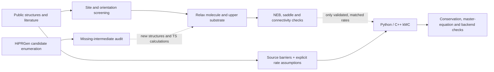

# Plasma Surface Dynamics

**Kinetic Monte Carlo (kMC) and atomistic workflows for studying dry and atomic-layer etching (ALE) of silicon and silicon nitride.**

In atomic layer etching, a surface is first *modified* (for example fluorinated by HF), then the modified layer is *removed* in a separate step. Ideally each cycle removes a fixed amount of material. This project asks:

> **Which surface motifs, competing reaction pathways and uncertain rates control whether a hydrogenated silicon-nitride surface is fluorinated or releases volatile Si, and what does that imply for per-cycle etch saturation?**

The project combines three things:

1. **Reaction-network kMC solvers**, in Python with a C++ backend, that track every atom and conserve mass on every event.
2. **Atomistic evidence**: MACE machine-learned potentials, NEB path searches and DFT single points on Si, Si₃N₄ and SiO₂ surfaces.
3. **A rate-evidence gate**: a rate enters the kinetics only when it is backed by matching calculations or literature. Missing chemistry stays disabled instead of being guessed.

> [!IMPORTANT]
> **Evidence boundary.** Passing numerical checks does not mean the model has been validated against experiment. The kinetics use published activation energies together with *assumed* prefactors, arrival rates and initial surface populations. The project does **not** yet predict a calibrated etch per cycle (EPC), composition effects or a complete plasma mechanism. Unconverged atomistic barriers are never used as rates.

## Current status

<!-- BEGIN CURRENT STATUS -->
| Component | Current status |
|---|---|
| Numerical checks | **100 tests passed**; atom conservation, independent master equation, Python/C++ statistical agreement and artifact provenance. |
| Species-resolved kMC | **45 states / 55 enabled events**, 16 source pathways; **512 C++ trajectories** across 325-450 K. Conditional kinetics, not calibrated ALE. |
| Network discovery | HiPRGen pilot: **40 forward + 40 reverse candidates**, with missing-intermediate audit; no automatic rate assignment. |
| Atomistic evidence | MACE surface paths and molecular screening; OMol25 local models and direct DFT diagnostics. Convergence limits retained. |
| Beyond rigid scans | **7/8 HF/substrate relaxations force-converged**, two starts on each of four surfaces; see reference convergence below. |
| Multilayer prototype | 336 Si/N atoms, six depth bands; explicit bonds and H/F/Cl termination. Unvalidated demonstration rates; strict mode blocks missing data. |
<!-- END CURRENT STATUS -->

*This table is regenerated from saved results by `python scripts/update_research_readme.py`.*

## Key findings so far

- **Flux and the starting surface matter more than any single chemical rate.** At 400 K, HF arrival rate outweighs every individual enabled reaction-rate group, and the assumed initial motif mixture strongly controls how much Si is released ([sensitivity analysis](docs/species_kmc_results/kinetic_priorities.json)).
- **A plateau does not by itself show ALE self-limitation.** In the 45-state model, Si removal plateaus at 60% because of the assumed initial mixture and missing release paths, not because of any surface chemistry that self-limits.
- **The multilayer stall is a gap in the mechanism, not a finding.** Over 12 cycles, removal stops after cycle 2. All 21 reachable Si sites are left with three F caps and one Si-N backbond whose final-cleavage rate is unknown, so those events are disabled ([diagnosis](docs/multilayer_results/cycle_diagnosis.json)).
- **Relaxing a structure is not enough to get a binding energy.** Bias from the clean-slab reference dominates some apparent HF adsorption energies, and Hessian checks exposed an unstable nitride reference. Those values are excluded from quantitative claims.


The [scientific review](docs/SCIENTIFIC_REVIEW.md) compares these results with independent literature and sets acceptance criteria for a publishable result.

## Quick start

Python 3.11+ on a normal CPU is enough for all kinetic models. A C++17 compiler (GCC/Clang) is optional.

```bash
python -m venv .venv
source .venv/bin/activate          # Windows: .venv\Scripts\Activate.ps1
python -m pip install -e ".[dev]"
python scripts/build_cpp.py         # optional: original two-state C++ backend
python scripts/build_species_cpp.py # optional: species-kMC C++ backend
python -m pytest -q                 # C++ tests are skipped if not built
```

Reproduce the species-resolved kMC results and figures:

```bash
python scripts/build_species_cpp.py        # required: ensembles use the C++ backend
python scripts/run_species_kmc.py          # Python + C++ ensembles -> docs/species_kmc_results/
python scripts/report_species_kmc.py       # report and plots
python scripts/plot_reaction_networks.py   # network diagrams -> docs/reaction_network/
python scripts/analyze_kinetic_priorities.py
python scripts/make_figures.py             # presentation figures -> docs/figures/
python scripts/update_research_readme.py   # refresh the status table above
```

The simple two-state demonstration model has a CLI: `plasma-lab demo`, `plasma-lab sweep`, `plasma-lab benchmark` (see [usage](docs/USAGE.md)). Atomistic workflows need a separate [MACE environment](docs/MACE.md), and model weights are not bundled. The [script catalog](scripts/README.md) lists every workflow, grouped by stage.

## Models

| Model | What it represents | Code | Results |
|---|---|---|---|
| **Species-resolved HF/SiN:H kMC** | 45 chemical states in 7 motif families, 55 events with published barriers; one initial surface inventory | [Python](plasma_surface/species_kmc.py), [C++](cpp/species.cpp) | [report](docs/species_kmc_results/REPORT.md) |
| **Multilayer bond-graph kMC** | 336 Si/N atoms in six depth bands with explicit bonds and H/F/Cl terminations; removing a product exposes the atoms beneath it | [Python](plasma_surface/multilayer.py) | [report](docs/multilayer_results/REPORT.md) |
| **F₂/Si first-event kinetics** | Published facet-specific rate laws | [Python](plasma_surface/dry_etch.py) | [report](docs/dry_etch_results/REPORT.md) |
| **Two-state ALE baseline** | Generic modify/remove model, used to test the software and run sensitivity sweeps; illustrative parameters | [Python](plasma_surface/model.py), [C++](cpp/surface.cpp) | [equations](docs/MODEL.md), [details](docs/PROJECT_DETAILS.md) |

These models have different scopes. Their rates and validation claims are **not interchangeable**.

### Species-resolved kMC


Each square is one reactive Si-centred motif followed through one HF dose and purge. Blue darkens from F0 to F3 as fluorine is added, orange dots are adsorbed HF, and grey squares have lost their Si as gas. Every frame is a saved stochastic snapshot, never an interpolation.


The network is generated directly from [`configs/species_kmc_network.json`](configs/species_kmc_network.json). Gray arrow pairs show HF adsorption/desorption, brown arrows show reactions labelled with their source barrier and released gas, and dashed pink steps have no matching barrier and are disabled. See also the [surface-state atlas](docs/reaction_network/SURFACE_ATLAS.md), a [zoomable SVG](docs/reaction_network/species_kmc_network.svg) and a table of [all event rates](docs/species_kmc_results/event_rates.csv).


### Multilayer bond graph


The side view shows one fixed slice through the slab, with Si in blue and N in green. Orange rings mark atoms exposed to the gas, and dashed circles mark removed atoms. B0 to B5 are unit-cell depth bands, not atomic monolayers.

<!-- BEGIN MULTILAYER STATUS -->
The 9 s demonstration recorded **1097 events**, **9 Si + 16 N removals**, and **20 newly exposed atoms**. Twelve access-depth/seed controls accompany it. The rate audit identifies **246 distinct missing-rate environments**, with separate IS/FS connectivity requests for priority cases.
<!-- END MULTILAYER STATUS -->

This is a **demonstration, not a calibrated multilayer ALE model**. Host atoms stay at fixed crystal positions, and accessibility uses a column approximation. The rates are unvalidated transfers or assumptions. In the default `validated_only` mode, unmatched environments stay disabled. The missing rates are listed as an [environment-specific calculation queue](data/multilayer/rate_requests/index.json).


## How the kMC works

Each step, the solver lists every eligible local event and its rate $a_j$, then makes two random draws:

1. a waiting time $\tau \sim \mathrm{Exp}(A)$ with $A=\sum_j a_j$, and
2. an event $j$ chosen with probability $a_j/A$ (events are **not** equally likely).

Dose/purge phase boundaries rebuild the rates without firing an event. After every event the solver checks valence and conserves every element, and a trajectory that fails these checks is rejected. See the [algorithm and flowchart](docs/KMC_ALGORITHM.md) for the full version.



All current kMC rates come from the literature branch (`A → E → F`). Newly relaxed geometries **do not** become rates automatically. The [parameter audit](docs/KINETIC_PARAMETERS.md) covers 183 parameter records and every event/temperature rate, and marks which ones are sourced and which are assumed.

## Atomistic evidence

<!-- BEGIN RELAXATION STATUS -->
**7/8 adsorbate/substrate relaxations meet 0.04 eV/angstrom.** Lower-half atoms remain fixed. Force convergence does not establish a stable minimum or transition state. [Full table, energy traces and actual relaxation GIFs](docs/dry_etch_results/RELAXED_ADSORPTION.md).


<!-- END RELAXATION STATUS -->

| Evidence | Result and how to read it |
|---|---|
| Site/orientation screen | 9 molecules × 4 surfaces, 2,592 evaluated geometries. This is an inventory of starting points, not evidence of transition states. |
| Surface diffusion paths | Three constrained MACE F/Cl migration NEBs ([surface paths](data/surface_paths/README.md)). |
| Water-derived surface saddle | N-to-N H transfer beside Si-OH on nitride, 2.27 eV above the connected initial state. This is not water dissociation or Si removal. |
| HF/HF and HF/H₂O coadsorbates | 8 candidates meet the force criterion, but full Hessians exposed an unstable reference, which is excluded ([report](docs/intermediate_results/REPORT.md), [stability](docs/intermediate_results/FULL_STABILITY.md)). |
| Final Si-N cleavage | PBE/def2-SVP and def2-TZVP energies/forces, two failed OMol25 NEBs and a checked constrained scan. These are diagnostics, **not** a TS barrier ([report](docs/final_cleavage_results/REPORT.md)). |


More detail: [molecular surfaces](docs/dry_etch_results/MOLECULAR_SURFACES.md), [transition states](docs/dry_etch_results/TRANSITION_STATES.md), [HiPRGen candidates](docs/HIPRGEN.md), [literature](docs/LITERATURE.md).

## Reproducibility and provenance

Every saved result records the SHA-256 of its inputs and of the exact code that produced it, and the test suite re-checks those hashes. Code can still be reformatted for readability. [`provenance/code_format_ledger.json`](provenance/code_format_ledger.json) lists formatting-only changes, and [`plasma_surface/provenance.py`](plasma_surface/provenance.py) accepts an old hash only when the current file has the same Python syntax tree as the recorded one. Any logic change breaks the match, and the affected results must then be regenerated. Run `python scripts/record_format_equivalence.py --base <rev>` after a formatting-only change.

Calculation scripts refuse to overwrite completed calculation directories. Invalidated runs are kept with an explicit `INVALIDATION.json` rather than deleted.

## Repository layout

```text
plasma_surface/   Importable library: kMC solvers, rate laws, rate-evidence gate, provenance
cpp/              C++17 backends (two-state model, species kMC), loaded via ctypes
configs/          Network topology, material cards and the qualified-rate library
scripts/          Calculation, analysis and report workflows (see scripts/README.md)
tests/            Conservation, numerical, backend and provenance checks
data/             Literature extracts, reference structures, atomistic calculations
docs/             Reports, method notes and figures (docs/figures/ = presentation figures)
provenance/       Formatting-equivalence ledger for recorded code hashes
hpc/              Example SLURM array job for parameter sweeps
third_party/      Pinned, licensed HiPRGen source snapshot
archive/          Historical diagnostics, excluded from active evidence
```

## Documentation

| Topic | Where |
|---|---|
| Guide to all documents | [docs/README.md](docs/README.md) |
| How to read each figure | [docs/figures/README.md](docs/figures/README.md) |
| Installation, CLI and C++ backend | [docs/USAGE.md](docs/USAGE.md) |
| kMC algorithm and sampling decisions | [docs/KMC_ALGORITHM.md](docs/KMC_ALGORITHM.md) |
| Every kinetic parameter and its source | [docs/KINETIC_PARAMETERS.md](docs/KINETIC_PARAMETERS.md), [docs/DRY_ETCH_PARAMETERS.md](docs/DRY_ETCH_PARAMETERS.md) |
| Datasets, structures and licensing | [docs/DATASETS.md](docs/DATASETS.md), [docs/ATOMISTIC_DATA.md](docs/ATOMISTIC_DATA.md) |
| Critique, open gaps and next calculations | [docs/SCIENTIFIC_REVIEW.md](docs/SCIENTIFIC_REVIEW.md), [docs/RESEARCH_PLAN.md](docs/RESEARCH_PLAN.md), [intermediate gaps](data/reaction_network/intermediate_gaps.csv) |

The original Si/SiNx material cards are hypothetical sensitivity scenarios. Public measurements are used only within their documented scope, and no experimental calibration data are fabricated.

## Author

Ryan ([ryanlai666](https://github.com/ryanlai666)). See [AUTHORS.md](AUTHORS.md). Third-party datasets, models and software keep their own authorship and licenses, and their citations are documented in this repository.
