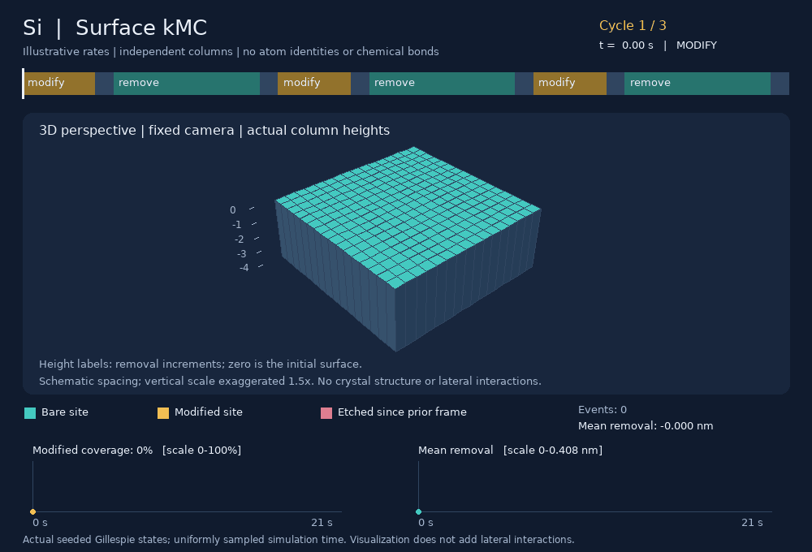
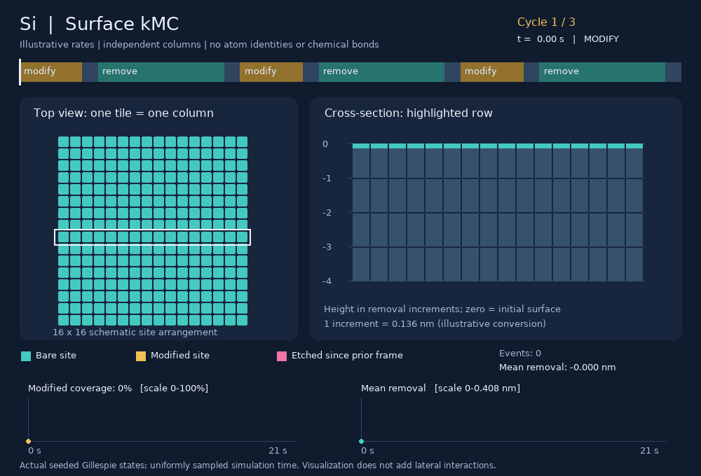
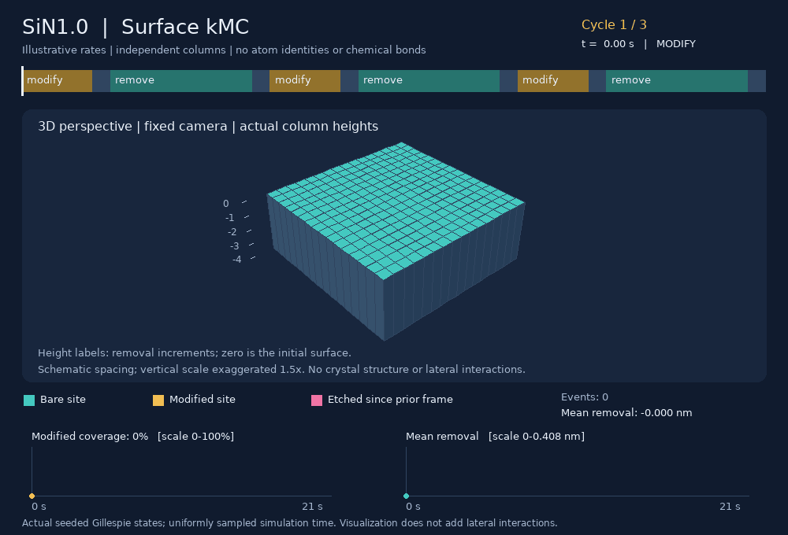
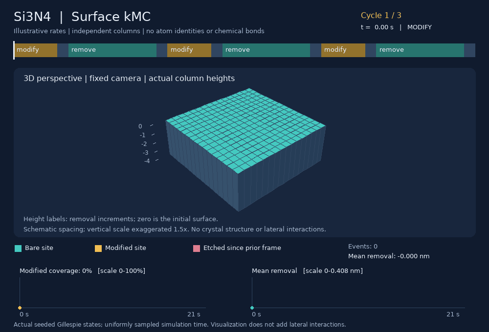
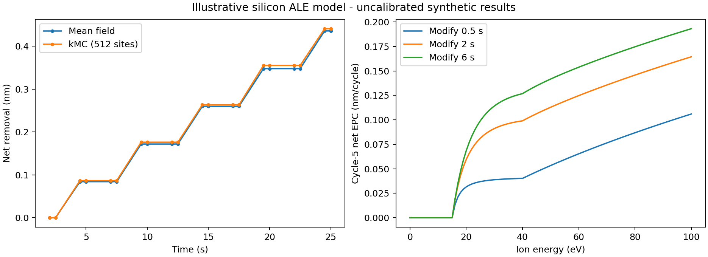
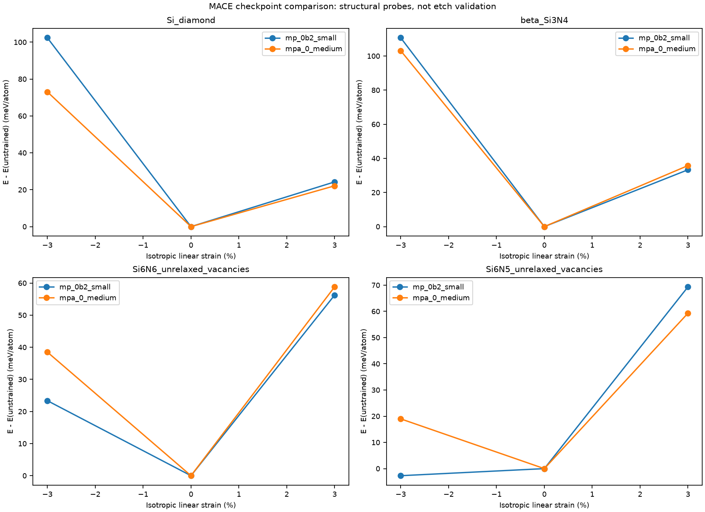
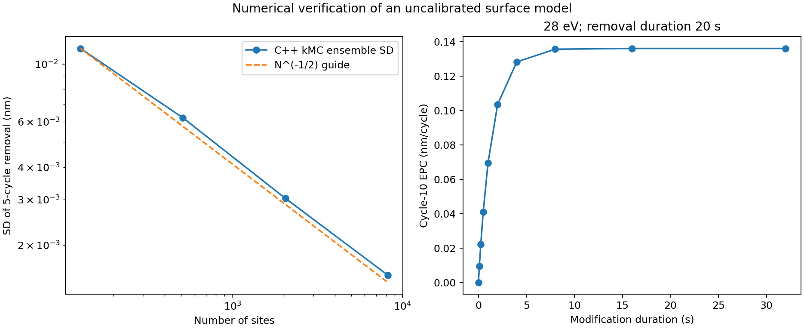
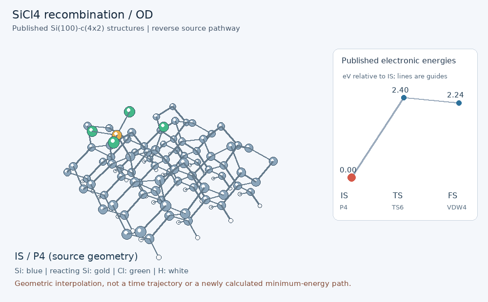
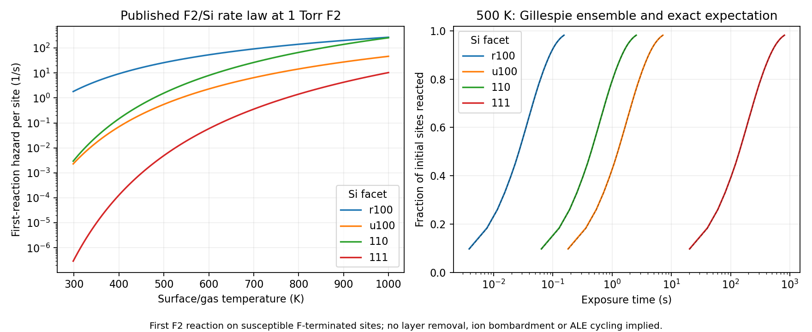
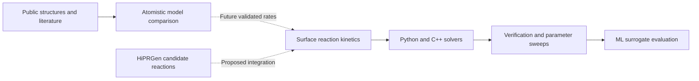

# Plasma Surface Dynamics

**Physics-based and machine-learning workflows for silicon and silicon-nitride atomic layer etching.**

Combining surface reaction kinetics, Python/C++ simulation, public atomistic data, and pretrained MACE force-field comparisons. 

**Research question:** How do surface modification, competing removal pathways, and uncertain reaction rates determine etch-per-cycle saturation and the usable ALE energy window?

> **Scientific scope:** This project verifies numerical implementations and compares atomistic models. Default ALE rates are uncalibrated, and SiNx composition cards are hypothetical sensitivity scenarios. The results do not establish experimental etching accuracy.

[Animations](#animation-gallery) | [Quick start](#quick-start) | [Results](#recorded-results) | [DFT/TS](#dry-etch-transition-states-and-reaction-parameters) | [Equations and literature](#physical-hypotheses-equations-and-literature-support) | [Documentation](#documentation-and-project-map)

## Animation gallery

Each movie follows three ALE cycles on 256 independent surface columns at 35 eV. **Teal** marks bare sites, **gold** marks modified sites, and **pink** marks removal since the preceding frame. The 3D perspective and the top-view/cross-section movies use the same seeded trajectory. Each 21 s simulation plays in 12.1 s.

### Silicon



<details>
<summary>Si: top view and linked height cross-section</summary>



</details>

### Silicon nitride composition scenarios

<details>
<summary><strong>SiN0.8: 3D perspective and top view</strong></summary>


</details>

<details>
<summary><strong>SiN1.0: 3D perspective and top view</strong></summary>




</details>

<details>
<summary><strong>Si3N4: 3D perspective and top view</strong></summary>




</details>

The columns represent model states and removal increments. Their spacing is schematic, and the 3D vertical scale is exaggerated 1.5x; neither view resolves atom identities, chemical bonds, or a crystal lattice. Nitride compositions label hypothetical rate cards.

Reproduce all eight GIFs with `python -m plasma_surface.animate`. [Visualization settings and fidelity checks](docs/ANIMATIONS.md) | [Trajectory and rendering provenance](docs/animations/manifest.json).

## Quick start

Python 3.11+ and a local CPU are sufficient. From a source checkout on Windows:

```powershell
python -m venv .venv
.venv\Scripts\Activate.ps1
python -m pip install -e ".[dev]"
python -m plasma_surface.cli demo
```

On Linux/macOS, activate with `source .venv/bin/activate`. The demo writes phase histories, a synthetic ML campaign, metrics, plots, and provenance to `outputs/demo/`.

| Task | Command |
|---|---|
| Generate the 2D and 3D animations | `python -m plasma_surface.animate` |
| Compare the four material cards | `python -m plasma_surface.cli materials` |
| Run published F2/Si first-reaction kinetics | `python -m plasma_surface.dry_etch` |
| Fetch the public DFT geometries | `python -m plasma_surface.cli fetch-data` |
| Run regression tests | `python -m pytest -q --basetemp=outputs/pytest-run` |
| Build the optional C++ backend | `python scripts/build_cpp.py` |
| Run the C++ demo | `python -m plasma_surface.cli demo --backend cpp` |
| Run the full numerical campaign after building C++ | `python -m plasma_surface.validation` |

The C++ build requires a C++17 GCC/Clang compiler. [Detailed setup, benchmarking, calibration, and deposition examples](docs/USAGE.md) | [Optional MACE environment](docs/MACE.md).

## Recorded results

| Check or comparison | Recorded result | Interpretation |
|---|---:|---|
| Regression suite | 29 tests passed | Analytical limits, kinetics, calibration recovery, backend checks, and animation-state fidelity |
| Python/C++ recipe comparison | 4,096 recipes | Same deterministic model evaluated by both implementations |
| Maximum backend EPC difference | 2.22e-16 nm/cycle | Numerical agreement |
| Stochastic ensembles | 6 of 6 within five standard errors | Agreement with the exact mean-field expectation |
| Synthetic surrogate held-out MAE | 0.00284 nm/cycle | Approximation of the uncalibrated model |
| Constant-baseline MAE | 0.05223 nm/cycle | Reference for the synthetic surrogate |
| MACE structural evaluations | 24 across two checkpoints | 12 structures evaluated by each model |
| MACE energy/force consistency | Both checks passed | Finite-difference tolerance: 1e-4 eV/angstrom |
| Public Si-HCl DFT geometry inventory | 22 structures | Provenance and checksums retained |

[Full simulation report](docs/results/REPORT.md) | [Raw benchmark timings](docs/results/benchmark.json) | [Research roadmap](docs/RESEARCH_PLAN.md)

The C++ kMC backend uses constant-time eligible-site selection. The recorded 2,048-site, 10-cycle benchmark had median times of 2.64048 s in Python and 0.002218 s in C++. This workload-specific comparison includes the algorithm change as well as compilation; timings vary with machine load and do not imply a universal speedup.

## Simulation and atomistic comparisons

<details>
<summary><strong>Si ALE: phase histories and ion-energy dependence</strong></summary>



Exact mean-field integration and stochastic Gillespie simulation describe the same illustrative kinetics. The energy sweep explores modification-dose dependence.

</details>

<details>
<summary><strong>Si/SiNx: comparison of two pretrained MACE models</strong></summary>



MACE-MP-0b2 small and MACE-MPA-0 medium are evaluated on diamond Si, beta-Si3N4, and two unrelaxed nitrogen-vacancy probes. Energies are referenced separately within each composition. These are structural comparisons, not an etch-rate validation or accuracy ranking.

[Atomistic report](docs/mace_results/REPORT.md) | [Hypothetical composition-rate comparison](docs/results/materials/comparison.png).

</details>

<details>
<summary><strong>Numerical verification: finite-site convergence and dose saturation</strong></summary>



Ensemble scatter decreases as the number of sites increases. The dose sweep checks saturation within the assumed mechanism.

</details>

<!-- BEGIN ATOMISTIC RESULTS -->
## Dry-etch transition states and reaction parameters

Surface reaction data now support a separate literature-based kinetics workflow:

| System and event | Published result | Current use |
|---|---|---|
| F2 activation on Si: reconstructed (100), unreconstructed (100), (110), (111) | Ea = 0.13, 0.31, 0.35, 0.57 eV, with fitted prefactors | Implemented first-reaction rates and Gillespie verification |
| HF on amorphous SiN:H | 16 fluorination paths; SiH2F2/SiHF3/SiF4 release barriers 0.81/0.96/0.53 eV | Reaction-specific reference table and prefactor sensitivity |
| SiCl4 / Si(100) | Six matched surface IS/TS/FS pathways, 17 structures | Source-based animations and forward/reverse barriers |
| HF impacts on Si3N4 | Six published ML-MD yields and seven surface-state coefficients | Reference with original units and conditions retained |
| Competing chemistry | 63 species/bookkeeping units, 45 balanced candidate reactions, 11 experiment sets | Fragments, recombination, carbon retention/removal and salt pathways |

[Sources, full parameter audit and equations](docs/DRY_ETCH_PARAMETERS.md) | [Dry-etch rate results](docs/dry_etch_results/REPORT.md) | [Fragments and experiment sets](docs/REACTION_CANDIDATES.md).

### Surface IS -> TS -> FS animation



**SiCl3* + Cl* -> SiCl4(physisorbed)** on reconstructed Si(100): the displayed reverse barrier is **2.4024 eV**. IS, TS and FS are published DFT structures; intermediate frames are geometric interpolation. This is a competing recombination/readsorption channel, **not proof of substrate Si removal**. [All six animations, barrier table and attribution](docs/dry_etch_results/TRANSITION_STATES.md).

### Literature-parameterized dry-etch kinetics



Reproduce with `python -m plasma_surface.dry_etch`. The F2 calculation uses published barriers and prefactors over their 298.15-1000 K fit range. It predicts the first reaction of susceptible sites; it does not yet predict a complete ALE cycle or EPC. The generic Cl2/Ar-inspired cards remain uncalibrated: thermal barriers cannot be substituted for ion-impact thresholds.

<!-- END ATOMISTIC RESULTS -->

## Physical hypotheses, equations, and literature support

The implemented model resolves bare/modified surface states. With modified fraction $\theta$, modification hazard $a$, desorption $d$, chemical removal $c$, physical removal $s$, and growth $g$ (all in s$^{-1}$):

$$
\frac{d\theta}{dt}=a(1-\theta)-(d+c+s+g)\theta,
\qquad \frac{dD}{dt}=\ell(c\theta+s-g).
$$

Here $D$ is net removed thickness and $\ell$ is the thickness increment. The rates use arrival fluxes, an Arrhenius desorption term, and an illustrative threshold yield:

$$
a=\frac{S\Gamma_r}{n_s},\quad d=\nu\exp[-E_d/(k_BT)],\quad
c=\frac{\Gamma_i}{n_s}Y_c(E),\quad
Y_j(E)=A_j\max\!\left(\sqrt{E/E_j}-1,0\right).
$$

**Hypotheses:** modification saturates available sites; ion-assisted removal depends on modification; newly exposed columns are bare; columns are independent. Increasing nitrogen content is assigned lower sticking and higher thresholds only as a sensitivity hypothesis, not an established composition law.

| Atomistic evidence | Implication for this project |
|---|---|
| [Si chlorination DFT/TDDFT](https://doi.org/10.1016/j.mssp.2022.107169) reports lower removal energy after modification | Supports separate bare/modified states; does not calibrate incident-ion thresholds |
| [SiN + CH3F first-principles study](https://doi.org/10.1016/j.apsusc.2020.148557) finds very low molecular sticking on its H-terminated surface | Current sticking values describe a generic effective radical channel, not measured CH3F sticking |
| [SiN ion-impact AIMD/tight-binding MD](https://doi.org/10.1063/5.0155929) examines adsorbate decomposition | Motivates explicit precursor fragments and collision-assisted reactions in a future mechanism |
| [Amorphous hydrogenated SiN + HF DFT](https://doi.org/10.1016/j.apsusc.2024.159414) resolves bond-cleavage pathways | Thermal barriers need specific states, hydrogen content, and chemistry before transfer to kMC |

**Parameter status:** the current values remain uncalibrated. A DFT reaction barrier in eV is not an ion-impact threshold in eV. The 35 eV animations illustrate the chosen cards; they are not a literature-validated ALE window.

[Detailed evidence, numerical parameters, hypotheses, and DFT/AIMD-to-kMC equations](docs/LITERATURE.md) | [Exact solver equations](docs/MODEL.md) | [Small public DFT barrier extract](data/literature/sin_hf_barriers.csv).

## Modeling workflow



Solid arrows describe implemented workflows; dashed arrows require further reaction data and model development. [HiPRGen assessment](docs/HIPRGEN.md).

## Public data and scientific scope

The project combines public surface-reaction data, literature-parameterized dry-etch rates, structural ML comparisons, and explicitly synthetic ALE campaigns. The [Si-HCl DFT archive](https://zenodo.org/records/10211009) contains 22 inventoried geometries with CC BY 4.0 attribution and checksums. The [16 HF/SiN fluorination pathways](data/literature/sin_hf_pathways.csv) retain their source energy references; the separate F2 kinetic model uses published prefactors. See [dataset sources and suitability](docs/DATASETS.md).

Composition is metadata in the current [Si/SiNx cards](configs/materials.json). Hydrogen content, preferential Si/N removal, film density, product speciation, and lateral interactions do not drive the kinetics. The inherited thickness conversion is illustrative for nitrides. The generic growth channel is not a validated PECVD/PEALD mechanism. Experimental calibration requires measurements matched to the implemented recipe and chemistry; none are fabricated or bundled.

## Documentation and project map

| Topic | Location |
|---|---|
| Equations and exact integration | [Model](docs/MODEL.md) |
| Dry-etch parameters and surface transition states | [Parameter audit](docs/DRY_ETCH_PARAMETERS.md), [rates](docs/dry_etch_results/REPORT.md), [IS/TS/FS GIFs](docs/dry_etch_results/TRANSITION_STATES.md) |
| Fragments, side reactions, and experiment sets | [Candidate mechanisms](docs/REACTION_CANDIDATES.md) |
| DFT/AIMD evidence, parameter audit, and hypotheses | [Literature](docs/LITERATURE.md) |
| Reproduction and extended command examples | [Usage guide](docs/USAGE.md) |
| Animation interpretation and settings | [Animations](docs/ANIMATIONS.md) |
| Validation method and recorded campaign | [Validation](docs/VALIDATION.md), [results](docs/results/REPORT.md) |
| Public atomistic data and MACE comparisons | [Datasets](docs/DATASETS.md), [MACE](docs/MACE.md) |
| Future reaction discovery and research milestones | [HiPRGen](docs/HIPRGEN.md), [research plan](docs/RESEARCH_PLAN.md) |
| Python kinetics and animation rendering | `plasma_surface/model.py`, `plasma_surface/animate.py` |
| C++ kernel and Python interface | `cpp/surface.cpp`, `plasma_surface/native.py` |
| Campaigns, ML, and calibration | `plasma_surface/workflows.py` |
| Material assumptions and regression checks | `configs/materials.json`, `tests/` |
| Optional cluster array template | `hpc/sweep.slurm` |

The SLURM array shards a deterministic design by recipe ID; merging and sorting the shards reproduces serial output.
