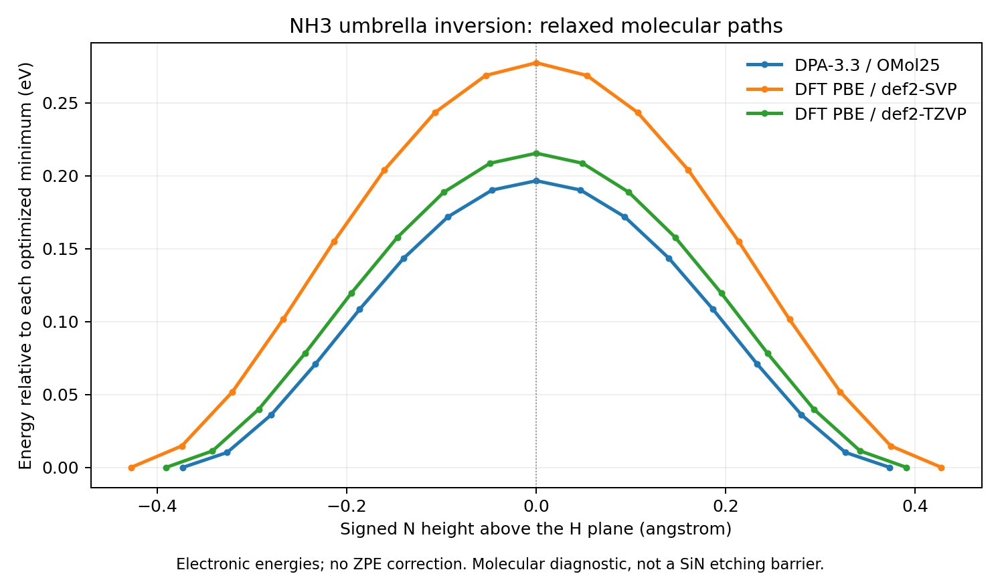

# Local molecular transition-state results

| Method | Electronic barrier (eV) | TS max force (eV/A) | Saddle checks |
|---|---:|---:|---|
| DPA-3.3 / OMol25 | 0.196504 | 7.86e-07 | Passed |
| DFT PBE / def2-SVP | 0.277387 | 1.88e-05 | Passed |
| DFT PBE / def2-TZVP | 0.215378 | 3.15e-05 | Passed |



Changing PBE from def2-SVP to def2-TZVP changes this electronic barrier by -0.062009 eV. This two-basis comparison does not establish the complete-basis limit.

These are actual local calculations on **neutral, singlet, nonperiodic NH3**. DPA uses the existing DPA-3.3-1M checkpoint's OMol25 head; direct DFT uses PySCF. The molecule provides a four-atom diagnostic for saddle searches involving a nitride-related gas product. It does not measure ammonia release from SiN, diffusion on Si, or an ALE etch barrier.

The signed umbrella coordinate is the N height relative to the H plane; the H triangle radius is relaxed at each of 17 scan points. The pyramidal minimum is optimized in both symmetry coordinates. The planar saddle is optimized in its in-plane radius. Both are checked using full Cartesian forces. Finite-difference Cartesian Hessians at 0.005 and 0.010 angstrom displacement each show exactly one eigenvalue below -0.01 eV/A^2 at the saddle; small translational/rotational numerical curvatures are not counted as instabilities. A minimum Hessian has no eigenvalue below that cutoff. Relaxing both signs of an umbrella displacement connects to symmetry-related minima of the same energy. This is a connectivity check, not a full IRC or a general-purpose TS search algorithm.

DFT uses restricted Kohn-Sham PBE, grid level 4, 1e-10 Hartree SCF tolerance, and four CPU threads. Every DFT SCF must converge. No zero-point or finite-temperature free-energy corrections are included. OMol25 training labels use a different functional/basis convention (wB97M-V/def2-TZVPD); model-versus-PBE differences therefore combine surrogate and reference-method differences. This example is not an independent model-accuracy benchmark; training overlap is unknown. No surface rate or prefactor is fitted from it.

## Reproduce

Reuse the existing Windows molecular ML environment:

```powershell
..\MLIP_benchmark\.venv-deepmd\Scripts\python.exe scripts/molecular_barrier.py `
  --backend deepmd --checkpoint ..\MLIP_benchmark\models\deepmd\DPA-3.3-1M.pt `
  --output outputs/barriers/omol25_nh3
```

The direct-DFT calculation runs in an isolated Linux/WSL environment created inside this workspace. In Ubuntu, from `/mnt/c/Ryan/python_code/Dry_ALE_Sim`:

```bash
python3 -m venv .venv-dft-wsl
.venv-dft-wsl/bin/python -m pip install -r requirements-dft.txt
OMP_NUM_THREADS=4 OPENBLAS_NUM_THREADS=1 MKL_NUM_THREADS=4 .venv-dft-wsl/bin/python scripts/molecular_barrier.py --backend pyscf --xc PBE --basis def2-svp --output outputs/barriers/pbe_svp_nh3
```

Repeat with `--basis def2-tzvp --output outputs/barriers/pbe_tzvp_nh3` for the larger-basis calculation.

Use a new output directory for every run; the runner refuses to overwrite existing results. Run `python scripts/report_barriers.py` to regenerate the report and its README block from the recorded `docs/barrier_results` files. The report does not launch calculations.

Each run contains optimized minimum/product XYZ structures, a saddle structure, relaxed-path energies, every evaluated energy/force/geometry, Hessian eigenvalues, explicit checks, package versions, source hash and (for ML) checkpoint hash. The script currently targets the NH3 symmetry coordinate; it is not an automatic reaction discovery or NEB tool. Computation times include optimization and all diagnostic evaluations and should not be treated as a controlled performance benchmark.

## Source and context

- [DPA-3.3-1M model and molecular input convention](https://huggingface.co/deepmodelingcommunity/DPA-3.3-1M).
- [OMol25 dataset and DFT labeling method](https://fair-chem.github.io/omol25/).
- [PySCF DFT documentation](https://pyscf.org/user/dft.html).

## Recorded runs

- [DPA-3.3 / OMol25 summary](omol25_nh3/summary.json), [manifest](omol25_nh3/manifest.json), [saddle](omol25_nh3/saddle.xyz): 321 evaluations; 33.7 s recorded computation time.
- [DFT PBE / def2-SVP summary](pbe_svp_nh3/summary.json), [manifest](pbe_svp_nh3/manifest.json), [saddle](pbe_svp_nh3/saddle.xyz): 221 evaluations; 173.9 s recorded computation time.
- [DFT PBE / def2-TZVP summary](pbe_tzvp_nh3/summary.json), [manifest](pbe_tzvp_nh3/manifest.json), [saddle](pbe_tzvp_nh3/saddle.xyz): 220 evaluations; 313.5 s recorded computation time.
