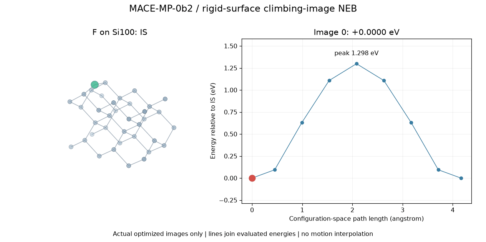

# Si100 / F migration

- Method: MACE-MP-0b2 small; rigid substrate CI-NEB
- Numerical status: converged; maximum NEB force 0.01855 eV/angstrom.
- Peak above IS: 1.298455 eV; FS minus IS: -0.000000 eV.
- [Every image and energy](energies.csv), [coordinates and forces](images.extxyz), [full provenance](summary.json).
- Animation has 9 evaluated images, with no interpolated frames.

## Model assumptions

- Ideal unreconstructed diamond surface, a=5.43 angstrom
- 36 Si substrate atoms held fixed; one halogen atom mobile
- 3 x 2 surface repeat, six atomic layers; 10 angstrom vacuum each side
- Periodic x/y only; no hydrogen passivation
- Single coverage, cell and image count; no convergence study
- Bulk-trained ML potential; no independent DFT accuracy validation
- NEB peak is a candidate saddle, not a frequency-verified full-surface TS
