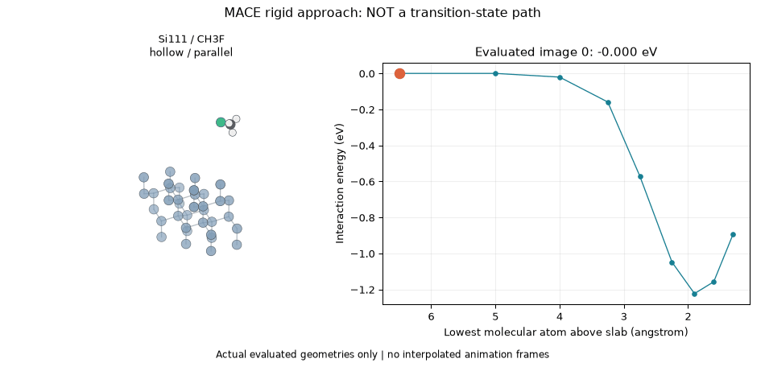
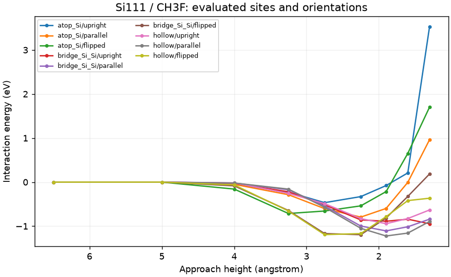

# Si111 / CH3F

These are rigid approach scans, not NEB paths or transition states. Each GIF frame has its own evaluated energy. The displayed curve has the lowest sampled interaction energy among the tested starts; it is not a globally optimized adsorption energy.

- Selected site/orientation: **hollow / parallel**.
- Lowest sampled interaction energy: **-1.22310 eV** at 1.9 angstrom.
- Tested 9 site/orientation combinations and 81 geometries.
- [All energies](mace_site_orientation/all_energies.csv), [selected coordinates](mace_site_orientation/hollow/parallel/images.extxyz), [selected provenance](mace_site_orientation/hollow/parallel/summary.json).
- [Shared assumptions, equations and sources](../../../../docs/dry_etch_results/MOLECULAR_SURFACES.md).
