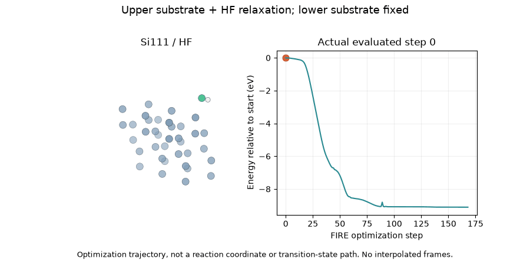

# Si111 / HF - relaxed start 1

Force-converged: **True**. HF bond retained (<=1.4 A); final HF separation 0.951 angstrom. This distance classification is not a full bonding or stability analysis.

Upper-substrate maximum displacement: 0.970 angstrom. Mobile substrate atoms: 18; all HF atoms mobile.

[Evaluated trajectory](trajectory.extxyz), [energies](energies.csv), [metadata](summary.json), [frame mapping](render_manifest.json).

No Hessian, TS, DFT or global-minimum validation is implied. [Campaign assumptions](../../../../../../docs/dry_etch_results/RELAXED_ADSORPTION.md).
