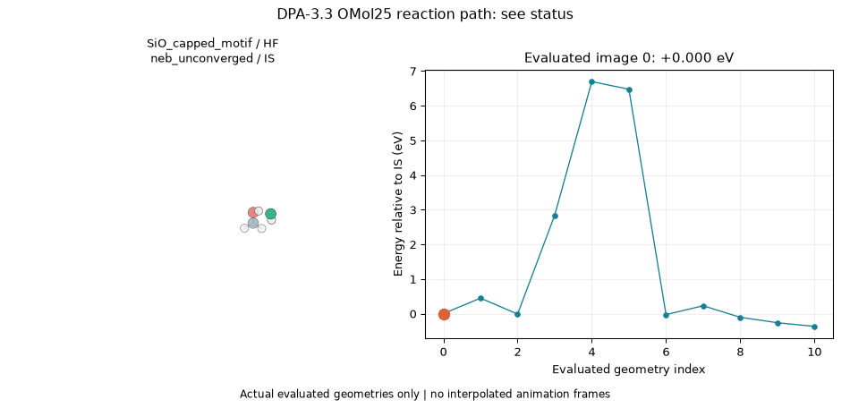

# SiO_capped_motif / HF: omol25_neb

Status: **neb unconverged**.

[Every image energy](energies.csv) | [Actual coordinates](images.extxyz).

Peak relative to IS: **6.6940 (unverified peak) eV**. A peak without convergence, curvature and connectivity is not a verified transition state.

[Calculation provenance and full checks](summary.json) | [Scope, equations and sources](../../../../../docs/dry_etch_results/MOLECULAR_SURFACES.md).

This is a capped molecular Si-N/Si-O bonding proxy, not a periodic slab or an etch-rate calculation. SiH3 is fixed.
