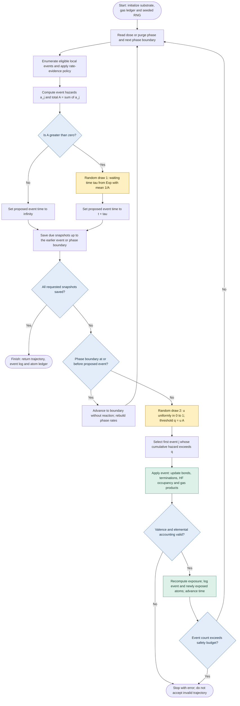

# kMC sampling and decisions

[Back to the project overview](../README.md)

This describes the implemented direct stochastic sampling loop in [`multilayer.simulate`](../plasma_surface/multilayer.py), not a new kinetic model. Rates are constant between events and prescribed dose/purge switches. General continuously varying rates would require a different integrated-hazard treatment.

## Flowchart

This flowchart follows the **multilayer graph solver**. Gold boxes mark random draws, blue diamonds mark decisions, and green boxes update the surface. Each eligible local event has a hazard in s^-1; unsupported rates remain disabled under the strict evidence policy.

## Two independent stochastic choices

For the current state, enumerate eligible event instances with nonnegative hazards $a_j$ (units $\mathrm{s}^{-1}$). The multilayer solver enumerates site/bond-specific instances; each instance already carries its local rate. Define

$$A = \sum_j a_j.$$

For $A>0$, the next-event waiting time has survival probability and sampling rule

$$P(\tau > s) = e^{-As}, \qquad \tau = -\frac{\ln r_1}{A}, \qquad r_1 \sim U(0,1).$$

The code uses `rng.exponential(1 / total)` directly. The formula explains the distribution; it does not claim NumPy internally computes this logarithm or that it consumes exactly one underlying RNG word.

If a chemical event occurs before the next phase boundary, draw an independent uniform $u \in [0,1)$, set $q=uA$, and choose the first event whose cumulative hazard exceeds that threshold:

$$C_j = \sum_{k=1}^{j} a_k, \qquad C_{j-1} \le q < C_j, \qquad P(j)=a_j/A.$$

This matches `searchsorted(cumsum(rates), rng.random() * total, side='right')`, with a final-index roundoff guard. Zero-hazard candidates cannot be selected. Selecting a rare event is possible; selecting all event types with equal probability would be incorrect.

## Deterministic decisions between draws

1. **Rate eligibility:** exclude inactive or fixed sites and disallowed local chemistry; evaluate accessibility and dose/purge conditions. Strict `validated_only` accepts only qualified environment-matched rate records. The published animated run explicitly uses unvalidated demonstration rates.
2. **No events available:** if $A=0$, set the proposed event time to infinity. Do not divide by zero or draw a waiting time. Advance through later phase boundaries until rates become nonzero or all requested samples have been saved. A zero-rate state during a purge need not be permanently absorbing.
3. **Observation times:** save every requested sample at or before the earlier of the proposed event and phase boundary, using the current state. Sampling does not reset the sampled waiting time. A sample exactly at an event time records the pre-event state under the code's `<=` convention. Once all requested samples are recorded, stop without executing an event beyond the observation horizon.
4. **Phase boundary first:** advance the clock to that boundary without a chemical event and without an event-selection draw. Recompute dose/purge rates and resample the waiting time. This is consistent with the exponential waiting law within each constant-rate interval.
5. **Reaction first:** select and execute one event. Update substrate edges, termination inventory, adsorbed HF and signed gas products. Validate active-host valences and element conservation, determine newly exposed atoms, append the event and advance the clock. Rebuild the event list for the changed local environments.
6. **Failure:** invalid valence/accounting or an exceeded event safety budget stops execution with an error. The safety budget is not physical completion or a convergence criterion.

The multilayer accounting assertion runs with normal Python execution; do not use `python -O` when relying on assertion-based checks.

## Distinction from the original 45-state motif solver

The [`species_kmc.py`](../plasma_surface/species_kmc.py) baseline uses the same exponential waiting-time and cumulative-hazard principles, but aggregates equivalent source motifs. For a reaction channel with per-motif rate $k_j$ and source population $n_{s(j)}$,

$$a_j = k_j n_{s(j)}.$$

After choosing a channel, the optional lattice visualization makes an **additional random integer draw** to choose uniformly among motifs in that source state. This assigns the already selected transition to a displayed site; it does not add another physical rate. The multilayer solver instead chooses an already site-specific event and needs no such assignment draw.

The original baseline has one exposure-to-purge switch. The multilayer implementation supports repeated prescribed dose/purge cycles, explicit bond changes, a fixed bottom band, and changing accessibility. The flowchart's graph updates and per-event valence checks refer specifically to the multilayer implementation.

A seeded generator makes each implementation reproducible for its configuration; different backends or random-draw order need not produce identical trajectories. Agreement should be assessed with the repository's statistical and conservation checks. This algorithm samples the supplied hazards correctly within its assumptions; it does not validate their physical values.
