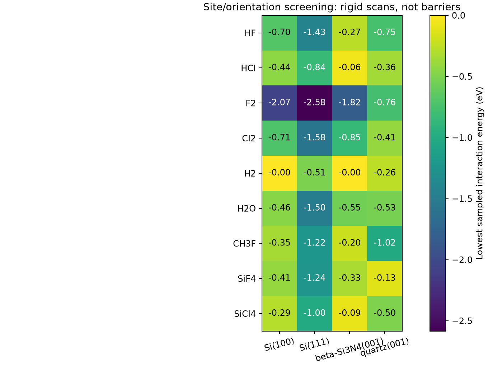

# Molecular dry-etch campaign: surfaces, sites and orientations

This campaign separates **evaluated approach scans**, **reaction-path searches**, and **validated transition states**. Their energy maxima are not interchangeable. All released animations display actual evaluated geometries; no intermediate animation frame is created by interpolation. IDPP interpolation is used only to initialize a NEB before force optimization.

## Force-relaxed follow-up

The [eight HF adsorption relaxations and reference-energy audit](RELAXED_ADSORPTION.md) extend the rigid screen. Seven force-converged, but substrate reconstruction makes some apparent Si/HF adsorption energies unsuitable for quantitative binding claims.

## Coverage and geometry

Nine neutral molecules are evaluated on four surfaces: **HF, HCl, F2, Cl2, H2, H2O, CH3F, SiF4 and SiCl4** on ideal **Si(100), Si(111), beta-Si3N4(001), and alpha-quartz(001)**. SiF4 and SiCl4 are included as possible products/readsorption partners; H2 and H2O test competing hydrogen and oxygen chemistry. Molecular reactants do not stand in for their plasma-generated radicals or ions.

| Surface | Construction | Lateral sites |
|---|---|---|
| Si(100) | ASE diamond, a = 5.43 angstrom, 3 x 2 repeat, six atomic layers (36 Si) | atop Si, Si-Si bridge, four-fold hollow |
| Si(111) | ASE diamond, a = 5.43 angstrom, 3 x 2 repeat, six atomic layers (36 Si) | atop Si, Si-Si bridge, three-fold hollow |
| beta-Si3N4(001) | COD 2102550, two unit-cell layers (28 atoms) | projections of highest Si, neighboring N, and Si-N bridge |
| alpha-quartz(001) | COD 9005018, two unit-cell layers, doubled along a (36 atoms) | projections of highest Si, neighboring O, and Si-O bridge |

Slabs are periodic in x/y, nonperiodic in z, with 12 angstrom vacuum on either side before adding the molecule. These are **unrelaxed, unpassivated ideal cuts**. Surface reconstruction, realistic amorphous SiNx:H, hydrogen/halogen coverage, bottom passivation and cell/thickness convergence have not been established. The crystalline Si3N4 result cannot determine an arbitrary Si:N composition trend. Quartz is a crystalline oxide proxy, not amorphous device oxide; its public bulk geometry was measured at 398 K, which does not make this calculation a 398 K simulation.

For each lateral site, the optimized isolated molecular geometry is rotated about y by **0, 90 and 180 degrees** (upright, parallel, flipped). Homonuclear diatomics omit the equivalent flipped case. Molecular x/y centroids are placed above the site. These are a finite set of starts, not an exhaustive azimuth/polar-angle search; some symmetries may make cases equivalent. Exact site atom indices, coordinates and orientation conventions are retained per curve.

Each curve evaluates nine lowest-atom heights: **6.5, 5.0, 4.0, 3.25, 2.75, 2.25, 1.9, 1.6, 1.3 angstrom** above the highest slab atom. A short-height point can be strongly repulsive. It must not be reported as a transition state.

## Energy definitions and interpretation

For fixed slab S and molecule M at height h, lateral site s and orientation R:

$$E_{int}(h,s,R)=E(S+M;h,s,R)-E(S)-E(M;R).$$

The separated references use the same lateral periodic cell. The molecular term is therefore a periodic molecular layer, not an isolated gas molecule. This subtraction removes the separate slab and molecular-layer self energies; it does not remove coverage effects on their interaction. The farthest-point residual is retained in the baseline metadata. All comparisons are within the same composition; raw total energies across stoichiometries are not compared.

The screening table reports the minimum **sampled** $E_{int}$, which is neither a relaxed adsorption energy nor an activation barrier. Differences across sites/orientations motivate multistart relaxation. Hypothesis: aligning a polar molecule toward chemically distinct surface atoms changes its interaction and the accessible dissociation channel. The screen tests energy sensitivity to those choices, not experimental sticking or etch yield.

For a separately optimized path with coordinates $q_i$:

$$E_{peak}-E_{IS}=\max_i E(q_i)-E(q_0),\qquad \Delta E=E(q_N)-E(q_0).$$

CI-NEB replaces the climbing image's spring force with an inverted force parallel to the path:

$$F_{CI}=-\nabla E+2(\nabla E\cdot\hat\tau)\hat\tau.$$

A candidate is accepted as a constrained saddle only after force convergence, one significant negative Hessian eigenvalue in the mobile subspace, stable endpoints, and downhill connectivity checks. Fixed atoms remove degrees of freedom: a saddle in that subspace is not automatically a full-surface saddle. Failed endpoint searches and unconverged paths remain labeled as such. We use a numerical curvature threshold of -0.02 eV/angstrom squared; small modes near this threshold require tighter finite-difference checks.

A validated free-energy barrier would enter thermal kinetics through $k(T)=\kappa k_BT/h\,\exp[-\Delta G^\ddagger/(k_BT)]$, or a justified prefactor and electronic barrier as an approximation. These calculations omit ZPE, entropy, tunneling, excited states, ion bombardment and plasma fluxes. They do **not** calibrate ALE EPC or ion-impact thresholds.

## Models and provenance

Periodic screening and molecular slab searches use **MACE-MP-0b2 small**, CPU/float64. It is a bulk-trained foundation model and has not been validated for these surface reactions. Per-folder JSON records model/source hashes; extxyz files and CSV tables pair each geometry with its calculated energy. The first portion of the orientation campaign includes forces. Its resumed energy-only evaluator skips force differentiation; a separate numerical audit checked 24 geometries spanning all four surfaces and HF/CH3F/SiCl4. Energy-only and regular evaluations agreed at the recorded precision; reproduction of earlier saved energies differed by at most 4.6e-8 eV. [Audit data](molecular_energy_checks.json). No force labels are claimed for energy-only frames.

For local bond cleavage we additionally use **DPA-3.3-1M, OMol25 head**, charge 0, multiplicity 1. The model card recommends this head for molecules; it does not establish accuracy for our Si-N/Si-O reactions. Capped H3SiNH2/HF and H3SiOH/HF systems keep SiH3 fixed and are explicitly **molecular local-bond proxies, not periodic surfaces**. NH3 occurs only as the nitrogen-containing cleavage product; there is no unrelated ammonia inversion example in this campaign.

Direct DFT checks, where present, use density-fitted **PBE/def2-SVP**, grid level 3, SCF threshold 1e-9 Hartree, with electronic energies and gradients at the saved ML geometries. These are DFT single points, not a DFT-relaxed NEB. PBE is also different from the OMol25 training level; disagreement mixes model error and differences in electronic-structure methods. Small-basis and fixed-cap limitations remain.

The SiO/HF OMol25 path did not converge. At saved image 5, the direct SCF failed; a Newton fallback returned an anomalous high-energy solution that could not be reproduced from three independent SCF starts. That image is explicitly rejected from DFT energy-profile interpretation. Its raw result and retry audit are retained for diagnosis. The SiN/HF ML path also remained unconverged, so even its complete DFT single-point profile is not a validated DFT barrier. None of these paths parameterizes the kMC.

## Connectivity and chemical identity of the water-derived saddle

The initial water dissociation NEB reached its force tolerance and had one negative curvature mode, but its downhill branch did **not** return to the initially chosen intact-water precursor. It reached a different, already dissociated OH + H minimum, 0.1426 eV lower. We therefore retain the original NEB as a candidate with unconfirmed original-endpoint connectivity.

A separate [local saddle trace](../../data/surface_paths/beta_Si3N4_001/H2O/mace_local_saddle/README.md) follows both branches to the minima actually reached. A subsequent [bond-distance audit](../../data/surface_paths/beta_Si3N4_001/H2O/mace_local_saddle/identity_audit.json) identifies **H transfer from N25 to N26 beside Si15-OH**, not water dissociation: the spectator O-H stays about 1.0 angstrom, while the migrating H remains more than 2 angstrom from O. Both endpoints have positive curvature in the 15 mobile degrees of freedom; the saddle has one negative mode. The peak is **2.2683 eV above this alternative local IS**, and the final state is **1.1684 eV above it**. This is a constrained MACE result for a competing surface H-migration step, not DFT validation or an ALE removal barrier. Its animation uses evaluated minimization snapshots (one branch reversed for viewing); it is not an IRC, MD trajectory or a new optimized NEB.

## Reactions, fragments and experimental discrimination

The following are balanced local bookkeeping reactions to test; an asterisk denotes an available adsorption site rather than a free gas radical. Inclusion is not evidence that a pathway is active.

| Reactant / local reaction | Competing channel or likely fragment | Useful experimental distinction |
|---|---|---|
| HF + Si* + N* -> Si-F + N-H | F/H termination, repeated fluorination, NHx intermediates | Si-F / N-H vibrational signals, isotope HF/DF, N loss vs termination |
| HF + Si* + O* -> Si-F + O-H | hydroxylation; H2O-assisted proton transfer | OH coverage, water dependence, volatile SiFx products |
| HCl + 2 Si* -> Si-Cl + Si-H | reversible molecular adsorption; Cl recombination | H/Cl coverage and temperature-dependent desorption |
| F2 + 2 Si* -> 2 Si-F | molecular precursor vs dissociation | incident-energy/temperature dependence and F uptake |
| Cl2 + 2 Si* -> 2 Si-Cl | recombination/desorption; SiClx retention | coverage-resolved XPS and SiClx mass spectra |
| H2O + Si* + N* -> Si-OH + N-H | oxygen incorporation rather than removal | O uptake and etch-rate suppression/enhancement |
| CH3F + Si* + N* -> Si-F + N-CH3 | intact weak adsorption, CHxFy fragments, carbon residue | carbon uptake, CHxFy/HCN channels; distinguish radical-rich plasma from neutral dosing |
| H3SiNH2 + HF -> H3SiF + NH3 | local Si-N cleavage proxy only | motivates NHx/N-containing product monitoring; does not predict bulk N removal |
| H3SiOH + HF -> H3SiF + H2O | local Si-O cleavage proxy only | tests proton-assisted substitution; not an oxide etch rate |
| SiF4 or SiCl4 + * -> adsorbed molecule | readsorption, ligand exchange, SiFx/SiClx surface fragments | product back-pressure and desorption tests |

Coverage, defects and reaction-generated termination should be varied before interpreting differences as material selectivity. Radical/ion cases require independent charge/spin and collision calculations; neutral molecular scans cannot substitute for those.

## Sources and reproduction

- Public bulk structures: [COD beta-Si3N4 2102550](https://www.crystallography.net/cod/2102550.html), [COD quartz 9005018](https://www.crystallography.net/cod/9005018.html), CC0. Quartz: Kihara (1990), [10.1127/ejm/2/1/0063](https://doi.org/10.1127/ejm/2/1/0063). CIFs and their hashes are retained; generated cuts are not published reaction structures.
- HF-assisted nitride/oxide mechanisms: Jung et al., [10.1116/1.5125569](https://doi.org/10.1116/1.5125569). Published cluster results motivate mechanistic comparisons, not substitution of our computed barriers for theirs.
- Fluorine-containing molecules on nitride: [Chowdhury et al. (2021)](https://www.sciencedirect.com/science/article/pii/S0169433221005572). Different surface terminations and molecular fragments motivate a broader site/termination campaign.
- H-terminated nitride/CH3F: [10.1016/j.apsusc.2020.148557](https://doi.org/10.1016/j.apsusc.2020.148557); amorphous SiN:H/HF: [10.1016/j.apsusc.2024.159414](https://doi.org/10.1016/j.apsusc.2024.159414). These published surfaces differ from our ideal unpassivated cuts.
- [MACE foundation models](https://mace-docs.readthedocs.io/en/latest/guide/foundation_models.html), [DPA-3.3-1M model card](https://huggingface.co/deepmodelingcommunity/DPA-3.3-1M), [OMol25 paper](https://arxiv.org/abs/2505.08762).

Run optional atomistic environments from the repository root (model checkpoints are not bundled):

```sh
python scripts/molecular_surface_campaign.py
python scripts/screen_molecular_sites_energy.py
python scripts/run_molecular_reaction_neb.py --cases beta_Si3N4_001/CH3F Si100/HCl
python scripts/cluster_reaction_paths.py --motif SiO --reactant HF --checkpoint /path/to/DPA-3.3-1M.pt
python scripts/cluster_reaction_paths_refined.py --motif SiO --reactant HF --checkpoint /path/to/DPA-3.3-1M.pt
python scripts/render_molecular_campaign.py
```

The baseline and reaction runners refuse to overwrite existing result directories. Reproduce in a fresh checkout/output copy; the energy-only site runner resumes completed curves. Both site-runner implementations are kept because their hashes identify which produced each curve. Optional DFT uses the same cluster script with `--evaluate-path <saved images.extxyz>` in an ASE/PySCF environment.

<!-- RESULTS -->

## Calculated screening results



| Surface | Molecule | Site / orientation at lowest sampled energy | E_int (eV) | Height (angstrom) | Data |
|---|---|---|---:|---:|---|
| Si100 | HF | hollow / upright | -0.6951 | 1.90 | [curves + GIF](../../data/surface_paths/Si100/HF/README.md) |
| Si100 | HCl | hollow / upright | -0.4381 | 1.90 | [curves + GIF](../../data/surface_paths/Si100/HCl/README.md) |
| Si100 | F2 | hollow / parallel | -2.0687 | 1.30 | [curves + GIF](../../data/surface_paths/Si100/F2/README.md) |
| Si100 | Cl2 | hollow / upright | -0.7085 | 1.90 | [curves + GIF](../../data/surface_paths/Si100/Cl2/README.md) |
| Si100 | H2 | atop_Si / upright | -0.0000 | 6.50 | [curves + GIF](../../data/surface_paths/Si100/H2/README.md) |
| Si100 | H2O | hollow / upright | -0.4626 | 1.60 | [curves + GIF](../../data/surface_paths/Si100/H2O/README.md) |
| Si100 | CH3F | hollow / upright | -0.3470 | 1.60 | [curves + GIF](../../data/surface_paths/Si100/CH3F/README.md) |
| Si100 | SiF4 | atop_Si / flipped | -0.4118 | 2.75 | [curves + GIF](../../data/surface_paths/Si100/SiF4/README.md) |
| Si100 | SiCl4 | atop_Si / flipped | -0.2910 | 3.25 | [curves + GIF](../../data/surface_paths/Si100/SiCl4/README.md) |
| Si111 | HF | bridge_Si_Si / upright | -1.4267 | 1.30 | [curves + GIF](../../data/surface_paths/Si111/HF/README.md) |
| Si111 | HCl | bridge_Si_Si / parallel | -0.8381 | 2.25 | [curves + GIF](../../data/surface_paths/Si111/HCl/README.md) |
| Si111 | F2 | hollow / parallel | -2.5844 | 1.30 | [curves + GIF](../../data/surface_paths/Si111/F2/README.md) |
| Si111 | Cl2 | atop_Si / parallel | -1.5786 | 1.90 | [curves + GIF](../../data/surface_paths/Si111/Cl2/README.md) |
| Si111 | H2 | hollow / parallel | -0.5061 | 2.25 | [curves + GIF](../../data/surface_paths/Si111/H2/README.md) |
| Si111 | H2O | bridge_Si_Si / upright | -1.4998 | 1.30 | [curves + GIF](../../data/surface_paths/Si111/H2O/README.md) |
| Si111 | CH3F | hollow / parallel | -1.2231 | 1.90 | [curves + GIF](../../data/surface_paths/Si111/CH3F/README.md) |
| Si111 | SiF4 | hollow / flipped | -1.2389 | 2.75 | [curves + GIF](../../data/surface_paths/Si111/SiF4/README.md) |
| Si111 | SiCl4 | atop_Si / flipped | -1.0043 | 2.75 | [curves + GIF](../../data/surface_paths/Si111/SiCl4/README.md) |
| beta_Si3N4_001 | HF | atop_N / upright | -0.2657 | 3.25 | [curves + GIF](../../data/surface_paths/beta_Si3N4_001/HF/README.md) |
| beta_Si3N4_001 | HCl | atop_N / upright | -0.0552 | 3.25 | [curves + GIF](../../data/surface_paths/beta_Si3N4_001/HCl/README.md) |
| beta_Si3N4_001 | F2 | atop_Si / upright | -1.8212 | 1.90 | [curves + GIF](../../data/surface_paths/beta_Si3N4_001/F2/README.md) |
| beta_Si3N4_001 | Cl2 | atop_Si / upright | -0.8503 | 2.25 | [curves + GIF](../../data/surface_paths/beta_Si3N4_001/Cl2/README.md) |
| beta_Si3N4_001 | H2 | atop_Si / upright | -0.0000 | 6.50 | [curves + GIF](../../data/surface_paths/beta_Si3N4_001/H2/README.md) |
| beta_Si3N4_001 | H2O | atop_Si / upright | -0.5477 | 2.25 | [curves + GIF](../../data/surface_paths/beta_Si3N4_001/H2O/README.md) |
| beta_Si3N4_001 | CH3F | atop_N / flipped | -0.2049 | 2.75 | [curves + GIF](../../data/surface_paths/beta_Si3N4_001/CH3F/README.md) |
| beta_Si3N4_001 | SiF4 | atop_Si / parallel | -0.3318 | 2.25 | [curves + GIF](../../data/surface_paths/beta_Si3N4_001/SiF4/README.md) |
| beta_Si3N4_001 | SiCl4 | atop_Si / parallel | -0.0876 | 2.25 | [curves + GIF](../../data/surface_paths/beta_Si3N4_001/SiCl4/README.md) |
| alpha_quartz_001 | HF | atop_O / flipped | -0.7471 | 1.30 | [curves + GIF](../../data/surface_paths/alpha_quartz_001/HF/README.md) |
| alpha_quartz_001 | HCl | atop_O / flipped | -0.3595 | 1.30 | [curves + GIF](../../data/surface_paths/alpha_quartz_001/HCl/README.md) |
| alpha_quartz_001 | F2 | atop_O / upright | -0.7644 | 1.60 | [curves + GIF](../../data/surface_paths/alpha_quartz_001/F2/README.md) |
| alpha_quartz_001 | Cl2 | atop_O / upright | -0.4131 | 1.30 | [curves + GIF](../../data/surface_paths/alpha_quartz_001/Cl2/README.md) |
| alpha_quartz_001 | H2 | atop_O / upright | -0.2560 | 1.90 | [curves + GIF](../../data/surface_paths/alpha_quartz_001/H2/README.md) |
| alpha_quartz_001 | H2O | atop_O / flipped | -0.5288 | 1.60 | [curves + GIF](../../data/surface_paths/alpha_quartz_001/H2O/README.md) |
| alpha_quartz_001 | CH3F | atop_O / flipped | -1.0162 | 1.60 | [curves + GIF](../../data/surface_paths/alpha_quartz_001/CH3F/README.md) |
| alpha_quartz_001 | SiF4 | atop_Si / flipped | -0.1287 | 2.75 | [curves + GIF](../../data/surface_paths/alpha_quartz_001/SiF4/README.md) |
| alpha_quartz_001 | SiCl4 | atop_Si / flipped | -0.5005 | 2.25 | [curves + GIF](../../data/surface_paths/alpha_quartz_001/SiCl4/README.md) |

## Molecular reaction searches

Failed searches are part of the evidence. `no distinct dissociation endpoints` means the initial and final breaking-bond distances did not identify intact versus broken states; it does not establish a barrierless reaction or identical endpoint structures.

| System | Method | Peak above IS (eV) | Numerical conclusion | Evidence |
|---|---|---:|---|---|
| alpha_quartz_001 / HF | molecular_neb | -- | no distinct dissociation endpoints | [data](../../data/surface_paths/alpha_quartz_001/HF/molecular_neb/README.md) |
| beta_Si3N4_001 / CH3F | molecular_neb | -- | interrupted for FIRE restart | [data](../../data/surface_paths/beta_Si3N4_001/CH3F/molecular_neb/README.md) |
| beta_Si3N4_001 / H2O | molecular_neb | -- | interrupted for FIRE restart | [data](../../data/surface_paths/beta_Si3N4_001/H2O/molecular_neb/README.md) |
| beta_Si3N4_001 / HF | molecular_neb | -- | no distinct dissociation endpoints | [data](../../data/surface_paths/beta_Si3N4_001/HF/molecular_neb/README.md) |
| Si100 / F2 | molecular_neb | -- | endpoint validation failed | [data](../../data/surface_paths/Si100/F2/molecular_neb/README.md) |
| Si100 / HCl | molecular_neb | -- | endpoint validation failed | [data](../../data/surface_paths/Si100/HCl/molecular_neb/README.md) |
| Si111 / Cl2 | molecular_neb | -- | no distinct dissociation endpoints | [data](../../data/surface_paths/Si111/Cl2/molecular_neb/README.md) |
| beta_Si3N4_001 / CH3F | molecular_refined | 0.2009 (unverified peak) | neb unconverged | [data](../../data/surface_paths/beta_Si3N4_001/CH3F/molecular_refined/README.md) |
| beta_Si3N4_001 / H2O | molecular_refined | 2.1257 (unverified peak) | neb converged; index-one candidate, connectivity unconfirmed | [data](../../data/surface_paths/beta_Si3N4_001/H2O/molecular_refined/README.md) |
| beta_Si3N4_001 / H2O | mace_local_saddle | 2.2683 | constrained saddle confirmed; water-derived OH + H; N-to-N H transfer; minimization branches, not IRC | [data](../../data/surface_paths/beta_Si3N4_001/H2O/mace_local_saddle/README.md) |
| SiN_capped_motif / HF | omol25_neb | 6.7250 (unverified peak) | neb unconverged | [data](../../data/surface_paths/SiN_capped_motif/HF/omol25_neb/README.md) |
| SiO_capped_motif / HF | omol25_neb | 6.6940 (unverified peak) | neb unconverged | [data](../../data/surface_paths/SiO_capped_motif/HF/omol25_neb/README.md) |
| SiN_capped_motif / HF | omol25_refined | 0.3669 (unverified peak) | neb unconverged; index-one candidate, connectivity unconfirmed | [data](../../data/surface_paths/SiN_capped_motif/HF/omol25_refined/README.md) |
| SiO_capped_motif / HF | omol25_refined | 9.4797 (unverified peak) | neb unconverged | [data](../../data/surface_paths/SiO_capped_motif/HF/omol25_refined/README.md) |

## Direct DFT checks on saved ML geometries

These compare electronic energies at the same saved geometries. Endpoint-only differences are reaction energies, not barriers. Full-path maxima remain single-point peaks, not DFT-optimized saddles.

| Local motif | Geometry set | Images | DFT FS - IS (eV) | DFT max - IS (eV) | Evidence |
|---|---|---:|---:|---:|---|
| SiN_capped_motif | dft_endpoints | 2/2 accepted | -0.7466 | 0.0000 | [energies](../../data/surface_paths/SiN_capped_motif/HF/dft_endpoints/energies.csv), [SCF metadata](../../data/surface_paths/SiN_capped_motif/HF/dft_endpoints/summary.json) |
| SiN_capped_motif | dft_path | 11/11 accepted | -0.7466 | 0.0516 | [energies](../../data/surface_paths/SiN_capped_motif/HF/dft_path/energies.csv), [SCF metadata](../../data/surface_paths/SiN_capped_motif/HF/dft_path/summary.json) |
| SiO_capped_motif | dft_endpoints | 2/2 accepted | -0.3264 | 0.0000 | [energies](../../data/surface_paths/SiO_capped_motif/HF/dft_endpoints/energies.csv), [SCF metadata](../../data/surface_paths/SiO_capped_motif/HF/dft_endpoints/summary.json) |
| SiO_capped_motif | dft_path | 10/11 accepted | -0.3264 | not reported: SCF unresolved | [energies](../../data/surface_paths/SiO_capped_motif/HF/dft_path/energies.csv), [SCF metadata](../../data/surface_paths/SiO_capped_motif/HF/dft_path/summary.json) |
