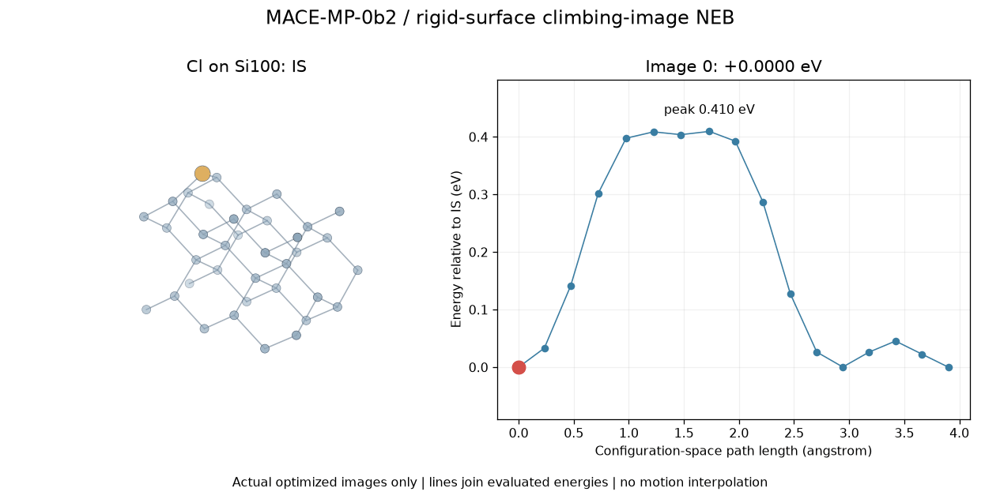
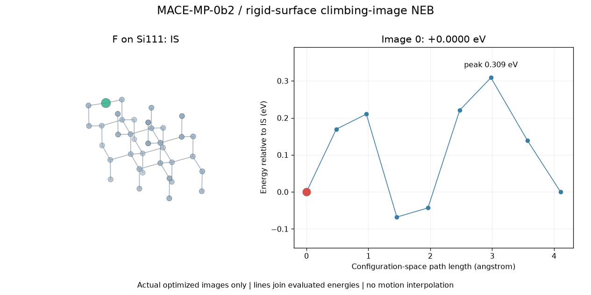

# Calculated paths and literature transition states

## What is calculated

Each new animation contains **only final force-optimized NEB images with an evaluated MACE energy**, ordered IS to candidate saddle to FS. The curves join those evaluated points; they are not continuous DFT sampling. Initial guesses inside the NEB algorithm are not animation frames. The older SiCl4 collection now displays only its three published stationary points, with no synthetic intermediate geometries.

A whole path may contain intermediate basins, especially the chlorine profile. Its maximum above the initial state is not automatically the activation energy of one elementary kMC hop: segment the path and determine local barriers/prefactors first.

The new calculations test `F*(A) -> F*(B)` and `Cl*(A) -> Cl*(B)` migration. These are transport side reactions relevant to halogen coverage, not completed Si removal or an ALE cycle. The substrate is ideal, unreconstructed and rigid. A converged result applies to that constrained ML potential only.

<!-- CALCULATED_TABLE -->

| Surface / species | Reaction | IS (eV) | Peak above IS (eV) | FS minus IS (eV) | Max NEB force (eV/A) | Validation |
|---|---|---:|---:|---:|---:|---|
| Si100 / Cl | Cl* (site A) -> Cl* (site B) | 0 | 0.4096 | +0.000000 | 0.0143 | constrained saddle checked |
| Si100 / F | F* (site A) -> F* (site B) | 0 | 1.2985 | -0.000000 | 0.0185 | constrained saddle checked |
| Si111 / F | F* (site A) -> F* (site B) | 0 | 0.3087 | +0.000000 | 0.0230 | constrained saddle checked |

### Si100 / Cl



[Coordinates, energies and checks](../../data/surface_paths/Si100/Cl/mace_neb/README.md). MPA-0 single-point sampled peak on this path: **0.6819 eV**; this is a model-sensitivity result, not an independent TS calculation.

### Si100 / F


[Coordinates, energies and checks](../../data/surface_paths/Si100/F/mace_neb/README.md). MPA-0 single-point sampled peak on this path: **1.7377 eV**; this is a model-sensitivity result, not an independent TS calculation.

### Si111 / F



[Coordinates, energies and checks](../../data/surface_paths/Si111/F/mace_neb/README.md). MPA-0 single-point sampled peak on this path: **0.0185 eV**; this is a model-sensitivity result, not an independent TS calculation.

<!-- END CALCULATED_TABLE -->

## Different surfaces and reactants: published barrier comparison

All eV entries below specify activation energy above their own reactant reference. They cannot be compared as absolute energies across compositions.

| Surface / reactant | Reaction or source site equation | IS (eV) | TS activation parameter (eV) | FS (eV) | Equation / use |
|---|---|---:|---:|---:|---|
| Strongly fluorinated Si3N4 / HF + H2O | R6: theta4 -> EP + theta1a | 0 | 0.6775 | Not supplied | Arrhenius R6; water-assisted removal |
| Strongly fluorinated SiO2 / HF + H2O | R6: theta4 -> EP + theta1a | 0 | 0.6376 | Not supplied | Arrhenius R6; oxide selectivity comparison |
| Strongly fluorinated Si3N4 / HF + HF(v=1) | R7: theta3 -> EP + theta1a | 0 | 0.1513 effective | Not supplied | Excitation-assisted activation model |
| Strongly fluorinated SiO2 / HF + HF(v=1) | R7: theta3 -> EP + theta1a | 0 | 0.6946 | Not supplied | Source assumes excitation quenches on oxide |
| Reconstructed Si(100) / F2 | First dissociative activation of an F-terminated site | 0 | 0.13 | Not supplied | Bimolecular temperature-dependent rate |
| Unreconstructed Si(100) / F2 | Same first-event family | 0 | 0.31 | Not supplied | Bimolecular temperature-dependent rate |
| Si(110) / F2 | Same first-event family | 0 | 0.35 | Not supplied | Bimolecular temperature-dependent rate |
| Si(111) / F2 | Same first-event family | 0 | 0.57 | Not supplied | Bimolecular temperature-dependent rate |
| Amorphous SiNx:H / HF | Si-N-SiH2F* + HF -> SiH2F2 + SiNH* (P2e) | Source reactant | 0.81 | Reference unresolved | Fragment-release candidate |
| Amorphous SiNx:H / HF | Si-N-SiHF2* + HF -> SiHF3 + SiNH* (P3e) | Source reactant | 0.96 | Reference unresolved | Fragment-release candidate |
| Amorphous SiNx:H / HF | Si-NH*-SiF3* + HF -> SiF4 + SiNH2* (P4) | Source reactant | 0.53 | Reference unresolved | Fully fluorinated volatile product |

Remote-plasma values: [Jung et al. (2020), Table I and Section II](https://doi.org/10.1116/1.5125569). Multiplying the reported Ea/R in kelvin by kB = 8.617333262145e-5 eV/K gives the eV values. The nitride R7 parameter subtracts 5800 K of vibrational excitation from the 7556 K ground-state barrier; it is **not a separately optimized excited-state TS**. EP is a lumped etch-product state. The original cluster models are Si7N8H7F11 and Si8O12H3F11. Rate prefactors for R6/R7 are computed from vibrational partition functions; desorption prefactors and selected sticking coefficients elsewhere in that model are fitted.

F2 values: [Dwivedi et al., v2 Table 1](https://arxiv.org/abs/2305.09037v2). SiNx:H values: [Khumaini et al.](https://doi.org/10.1016/j.apsusc.2024.159414), [public author poster](https://avssymposium.org/ALD2024/Sessions/SupplementalDocumentDownload/80689?sessionId=79078). The full [16-path motif table](../../data/surface_paths/SiNxH_amorphous/HF/literature/pathways.csv) includes NH3 and H2 formation as competing products; this is surface-bond chemistry, not molecular NH3 inversion.

Seven additional SiO2/HF cluster/slab reactions and DFT-versus-ReaxFF numbers are [transcribed separately](../../data/surface_paths/SiO2/HF/literature/README.md). Their table units require confirmation, so they are excluded from this eV comparison. Raw Cartesian paths were not recovered for these literature systems. Missing energies are left missing; no invented FS points or animations are supplied.

## Equations, hypotheses and parameter transfer

For one composition and energy convention:

$$E_a^\rightarrow=E_{TS}-E_{IS},\quad \Delta E=E_{FS}-E_{IS},\quad E_a^\leftarrow=E_a^\rightarrow-\Delta E.$$

For a minimum-energy path, ordinary NEB removes the physical force along the tangent and retains the spring force along it:

$$\mathbf F_i^{NEB}=-\nabla E_i|_\perp+k_s(|\mathbf R_{i+1}-\mathbf R_i|-|\mathbf R_i-\mathbf R_{i-1}|)\hat\tau_i.$$

At the climbing image the spring is removed and the parallel physical force is reversed:

$$\mathbf F_i^{CI}=-\nabla E_i+2(\nabla E_i\cdot\hat\tau_i)\hat\tau_i.$$

The present constraints apply these conditions only to the mobile adsorbate. A three-coordinate finite-difference Hessian checks endpoint minima and whether the peak has one negative curvature in this subspace. A full-surface TS requires releasing substrate degrees of freedom, a vibrational check and endpoint connectivity; the local check is not that validation.

For thermal surface events, use either a justified Arrhenius prefactor or harmonic transition-state theory:

$$k=A\exp[-E_a/(k_BT)],\qquad A_{HTST}=\frac{k_BT}{h}\frac{Q_{vib}^{TS}}{Q_{vib}^{IS}}.$$

The unstable TS mode is excluded from its vibrational partition function. A free-energy expression instead uses $k=\kappa k_BT/h\exp[-\Delta G^\ddagger/(k_BT)]$; do not double-count vibrational contributions. For F2 the source uses $k_2=A_0(T/298.15)^{n_1}\exp[-E_a/(k_BT)]$ in m3/s, then per-site hazard $r=k_2n_{F2}$.

For kMC, $R=\sum_jr_j$, $\Delta t=-\ln u/R$, and event probability $r_j/R$. A lattice diffusion event also needs occupied-origin/empty-destination rules and coordination dependence. A simple independent hop model would give $D=z\ell^2k_{hop}/(2d)$, with z equivalent destinations, hop distance ell and dimension d; correlated surface hops need a correction. The current column kMC does not implement these hops, so the new barriers are not silently injected into it.

**Hypotheses to test:** facet reconstruction and halogen coverage change migration; HF/H2O coadsorption changes bond-cleavage kinetics; surviving HF vibrational excitation can alter nitride/oxide selectivity; partially fluorinated SiHxFy competes with SiF4 release. Their rates require matching geometry, coverage, composition, charge, temperature and energy reference. None of these thermal barriers determines an incident-ion threshold.

## Reproduce and improve

The commands write to fixed result folders. For a clean rebuild, use a disposable repository copy with its model cache, and move that copy's three generated `mace_neb` folders aside first. To replay the recorded runs, retain the committed restart coordinates and use the commands in each summary. Refinement preserves its coarse attempt and refuses to overwrite an existing archived attempt. The recorded `command` and restart-file hashes in each summary describe this run. The three runs began from symmetry-broken adsorbate minima after the initial symmetric guesses failed curvature checks. Chlorine required 17 images because its 9-image peak was a local minimum; the coarse result is retained in `attempts/coarse_9/` and is not an accepted TS.

```powershell
.\.venv-mace\Scripts\python.exe scripts/run_surface_neb.py --surface Si100 --species F
.\.venv-mace\Scripts\python.exe scripts/run_surface_neb.py --surface Si100 --species Cl
.\.venv-mace\Scripts\python.exe scripts/run_surface_neb_bfgs.py --surface Si111 --species F --steps 120
.\.venv-mace\Scripts\python.exe scripts/refine_surface_neb.py data/surface_paths/Si100/Cl/mace_neb
.\.venv-mace\Scripts\python.exe scripts/validate_surface_neb.py
.\.venv-mace\Scripts\python.exe scripts/render_calculated_paths.py
```

Each surface/reactant folder stores coordinates, pointwise energies, optimizer logs, checkpoint/script hashes and model assumptions. MACE-MP-0b2 is the optimizer potential; MACE-MPA-0 evaluates the same images as a sensitivity comparison. That comparison is neither an independently relaxed second path nor DFT ground truth. [MACE foundation-model documentation](https://mace-docs.readthedocs.io/en/latest/guide/foundation_models.html).

The existing DPA OMol25 branch in the neighboring MLIP_benchmark project was used there for gas-phase fragments. It is not assumed validated for periodic reactive slabs. The appropriate next accuracy work is periodic slab DFT single points and CI-NEB, with reconstructed/passivated surface choices, slab-size/coverage convergence, sufficient mobile layers, spin checks where needed, and TS vibrations. Store those calculations in the same chemistry folders under a separate method directory rather than overwriting ML results.
