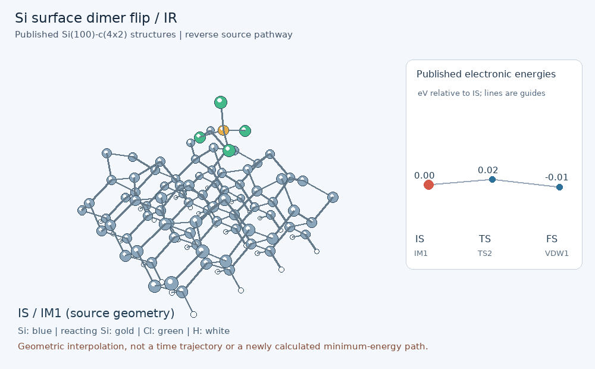
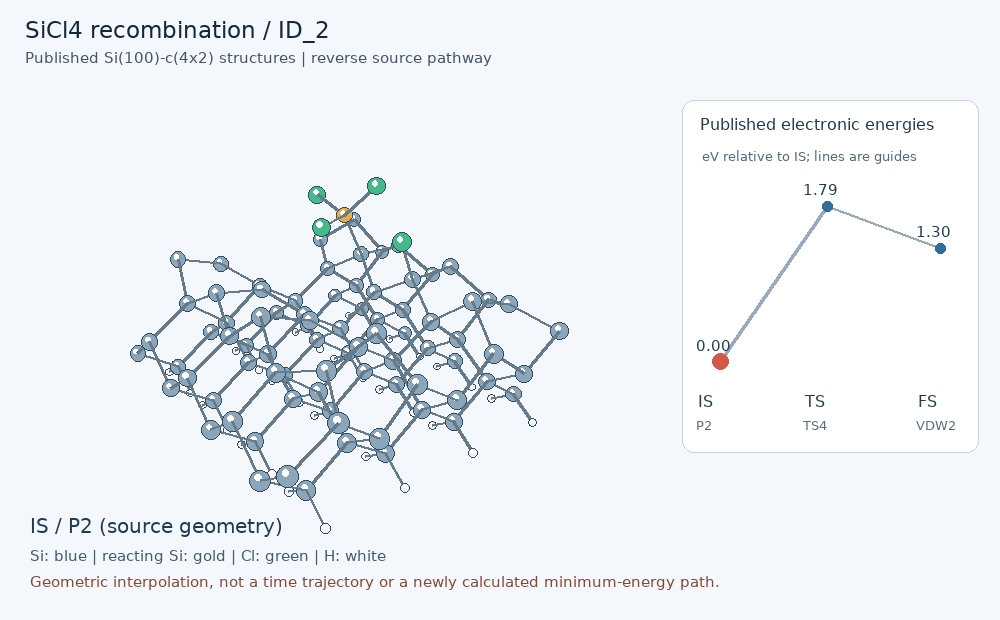
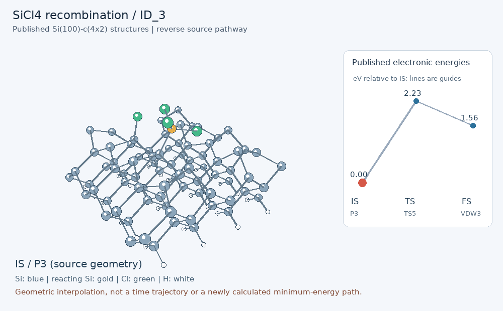

# Published surface transition states: IS -> TS -> FS

These animations use actual published stationary-point coordinates from [Zhang, Zhu and Li, Symmetry 15, 213 (2023)](https://doi.org/10.3390/sym15010213), CC BY 4.0. Each triplet has 117 atoms with consistent source atom order. Rendering adds only rigid translation and interpolated intermediate frames. The source reports CI-NEB; raw NEB images and Hessians were not supplied.

The displayed direction reverses source adsorption: **SiCl3* + Cl* -> SiCl4(physisorbed)**, except for the dimer-flip triplet. This is a relevant readsorption/recombination side channel. It does not demonstrate that a bulk substrate Si atom has been removed. The FS is a physisorbed complex, not an infinitely separated gas product.

| Path | Displayed IS -> TS -> FS | Source adsorption/flip barrier (eV) | Displayed reverse barrier (eV) |
|---|---|---:|---:|
| IR_direct | P1 -> TS1 -> VDW1 | 1.2315 | 2.7146 |
| IR_flip | IM1 -> TS2 -> VDW1 | 0.0304 | 0.0217 |
| IR_after_flip | P1 -> TS3 -> IM1 | 0.6982 | 2.1899 |
| ID_2 | P2 -> TS4 -> VDW2 | 0.4857 | 1.7866 |
| ID_3 | P3 -> TS5 -> VDW3 | 0.6721 | 2.2333 |
| OD | P4 -> TS6 -> VDW4 | 0.1604 | 2.4024 |

Intermediate frames are **geometric interpolation**, not AIMD time frames or recalculated energy-path points. Only IS/TS/FS energies are plotted; connecting lines are guides. Bonds are distance-based visual guides, not electronic bond orders.

## IR_direct

## IR_flip

## IR_after_flip

## ID_2

## ID_3

## OD

[Source coordinate inventory](../../data/reference/sicl4_surface/README.md) | [Energy references](../../data/literature/sicl4_surface_paths.json) | [Rendering manifest](animations/manifest.json). Reproduce with `python scripts/animate_surface_paths.py` in an ASE environment.
