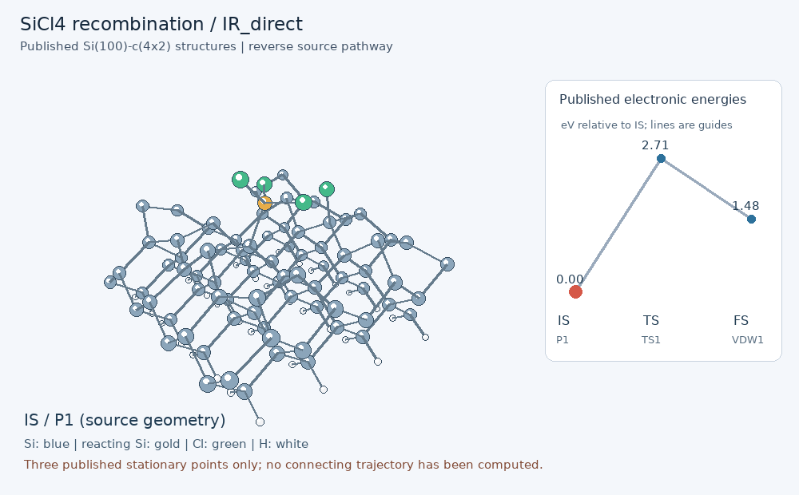
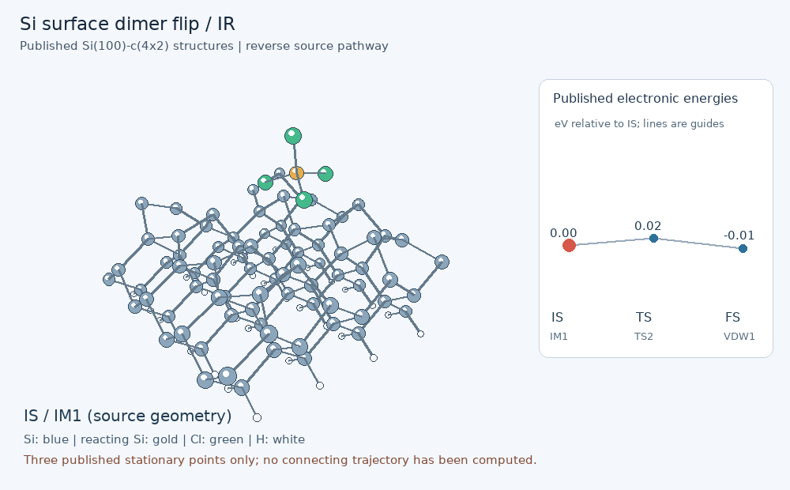
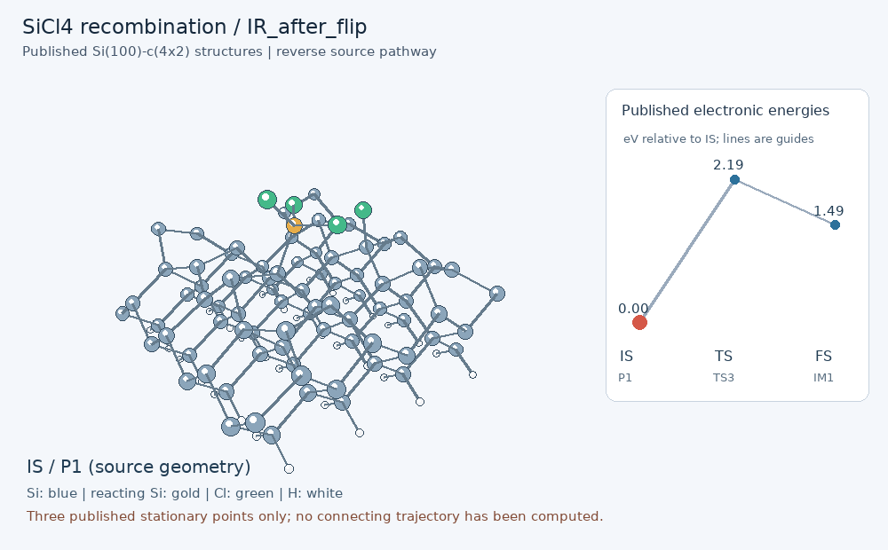
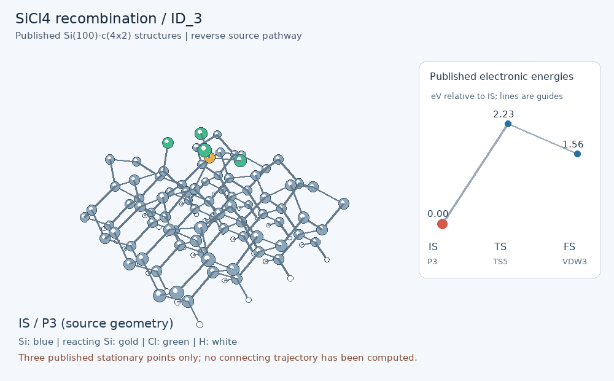
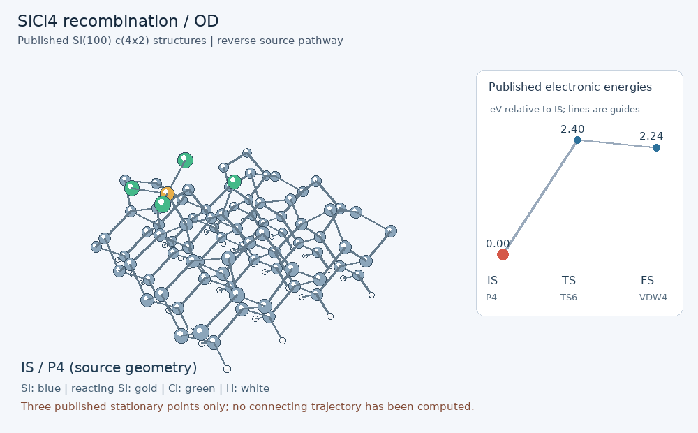

# Published surface stationary points: IS -> TS -> FS

For force-optimized paths with an energy at every image, see [calculated surface paths](SURFACE_PATHS.md).

These animations use actual published stationary-point coordinates from [Zhang, Zhu and Li, Symmetry 15, 213 (2023)](https://doi.org/10.3390/sym15010213), CC BY 4.0. Each triplet has 117 atoms with consistent source atom order. Rendering shows only the three original stationary points, with rigid translation for display. No intermediate frames are synthesized. The source reports CI-NEB; raw NEB images and Hessians were not supplied.

The displayed direction reverses source adsorption: **SiCl3* + Cl* -> SiCl4(physisorbed)**, except for the dimer-flip triplet. This is a relevant readsorption/recombination side channel. It does not demonstrate that a bulk substrate Si atom has been removed. The FS is a physisorbed complex, not an infinitely separated gas product.

| Path | Displayed IS -> TS -> FS | IS (eV) | TS peak above IS (eV) | FS minus IS (eV) | Barrier FS -> IS (eV) |
|---|---|---:|---:|---:|---:|
| IR_direct | P1 -> TS1 -> VDW1 | 0 | 2.7146 | 1.4831 | 1.2315 |
| IR_flip | IM1 -> TS2 -> VDW1 | 0 | 0.0217 | -0.0087 | 0.0304 |
| IR_after_flip | P1 -> TS3 -> IM1 | 0 | 2.1899 | 1.4917 | 0.6982 |
| ID_2 | P2 -> TS4 -> VDW2 | 0 | 1.7866 | 1.3009 | 0.4857 |
| ID_3 | P3 -> TS5 -> VDW3 | 0 | 2.2333 | 1.5611 | 0.6721 |
| OD | P4 -> TS6 -> VDW4 | 0 | 2.4024 | 2.2419 | 0.1604 |

These three-frame slideshows are **not continuous reaction trajectories**. Only IS/TS/FS energies are plotted; connecting lines are guides. Bonds are distance-based visual guides, not electronic bond orders.

## IR_direct

## IR_flip

## IR_after_flip

## ID_2

## ID_3

## OD

[Source coordinate inventory](../../data/surface_paths/Si100_c4x2/SiCl4/published/README.md) | [Energy references](../../data/literature/sicl4_surface_paths.json) | [Rendering manifest](../../data/surface_paths/Si100_c4x2/SiCl4/published/manifest.json). Reproduce with `python scripts/animate_surface_paths.py` in an ASE environment.
