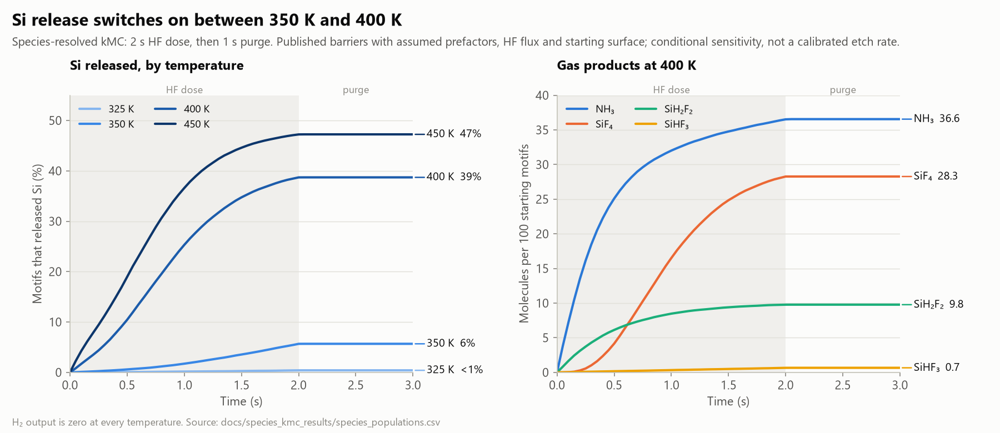
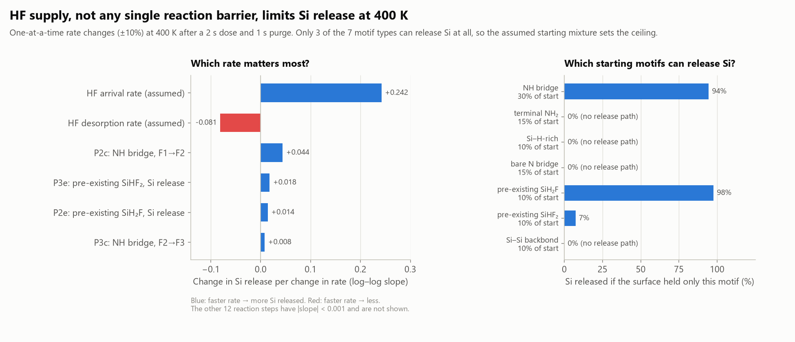
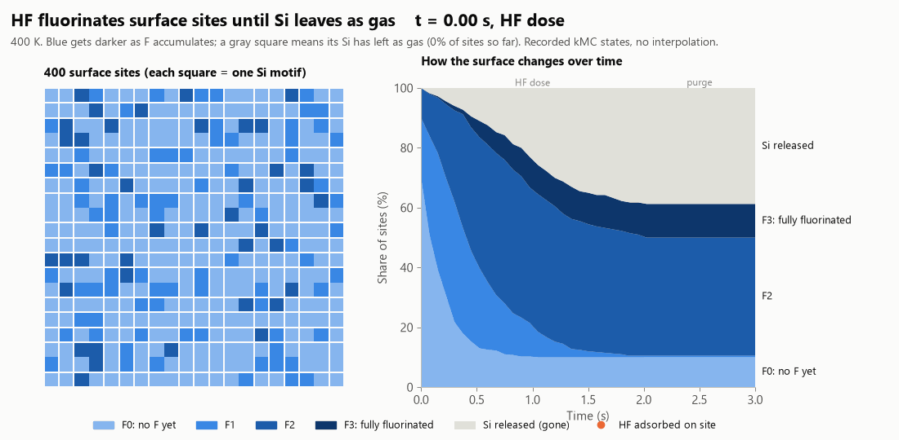
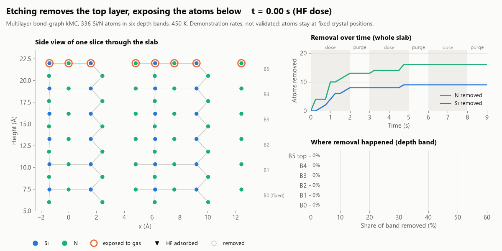
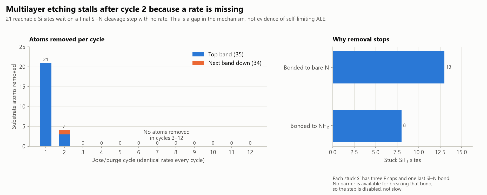
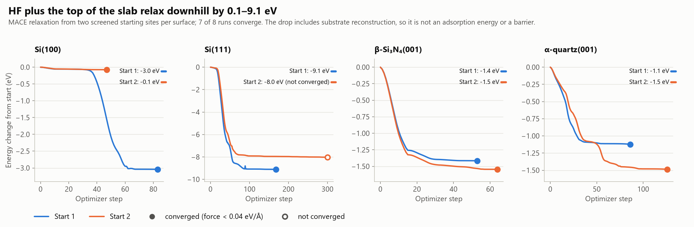
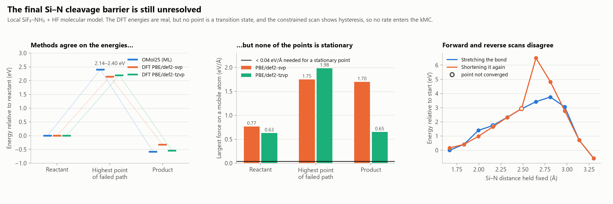

# Figure guide

[Back to the project overview](../../README.md)

These figures are drawn by [`scripts/make_figures.py`](../../scripts/make_figures.py) from **saved results only**. The script runs no simulation, and [`manifest.json`](manifest.json) records the SHA-256 of every input file. The tests check that those inputs, the drawing code and the images still match. The original diagnostic plots in the `docs/*_results/` folders are kept unchanged as the calculation record.

Every figure follows the same conventions:

- **The title states the finding.** The grey subtitle gives the conditions and the caveat.
- **Blues that darken show an ordered quantity**, such as higher temperature or more fluorine. Distinct hues (blue, orange, green, yellow) identify separate things, such as gas products or methods.
- **Values are labelled directly** on or beside the marks, so you don't have to read them off the axis.
- **Filled marker = converged. Hollow marker = not converged.**
- **Grey bands** mark the HF dose, and white gaps mark the purge.

The colours were checked for colour-blind separation. Every colour also comes with a label, so no information is carried by colour alone.

## Species-resolved kMC

### Si release by temperature



**How to read it.** On the left, each line is one temperature, showing the percentage of surface motifs whose Si has left as gas. Nothing changes during the purge because the model has no HF arriving then. On the right are the gas molecules produced at 400 K per 100 starting motifs.

**Takeaway.** Si release is negligible at 325 K and 6% at 350 K, then jumps to 39% at 400 K. Most released N leaves as NH₃ and most Si as SiF₄. These are conditional numbers, because prefactors, HF flux and the starting surface are assumed.

### What controls Si release



**How to read it.** On the left, each bar shows how strongly Si release responds when one rate is increased by 10%. A slope of 0.24 means +10% HF arrival gives about +2.4% more released Si. Blue bars increase release and red bars reduce it. On the right is the Si that would be released if the whole surface started as one motif type, with that motif's assumed share of the real starting surface under its name.

**Takeaway.** The assumed HF arrival rate matters far more than any published reaction barrier. Four of the seven motif types cannot release Si at all in this network, so the assumed starting mixture caps the total.

### Species kMC animation



**How to read it.** On the left, each square is one Si-centred surface motif. Blue darkens from F0 to F3 as fluorine is added, orange dots are HF molecules currently sitting on a site, and grey squares have lost their Si as gas. On the right, the same states are shown as shares of the surface over time, with the black line marking the current frame. Every frame is a recorded kMC state.

## Multilayer bond-graph kMC

### Multilayer animation



**How to read it.** On the left is a side view of one fixed slice through the slab, with Si in blue and N in green. Orange rings mark atoms currently exposed to the gas, dashed circles mark removed atoms, and B0 to B5 are depth bands. At top right is the cumulative Si and N removed from the whole slab, with the dose/purge schedule shaded. At bottom right is the share of each depth band removed so far.

### Why multilayer etching stalls



**How to read it.** On the left are atoms removed in each of 12 identical dose/purge cycles, split by depth band. On the right are the reachable Si sites left with three F caps and one remaining Si–N bond, grouped by what that N carries.

**Takeaway.** Removal stops after cycle 2 because no barrier exists for the final Si–N cleavage, so the step is switched off. This is a missing rate, not evidence that the chemistry self-limits.

## Atomistic checks

### HF relaxation on four surfaces



**How to read it.** Each panel is one surface, with two starting positions for HF. The lines show energy relative to the starting geometry as the optimizer moves HF and the top of the slab. A filled end dot means the forces reached the 0.04 eV/Å criterion.

**Takeaway.** All runs go downhill, sometimes by several eV, because the substrate itself reconstructs. So these numbers are **not** adsorption energies. The [reference audit](../dry_etch_results/RELAXED_ADSORPTION.md) separates the two contributions.

### Final Si–N cleavage checks



**How to read it.** On the left are energies at three fixed geometries from an ML model and two DFT basis sets. In the middle is the largest remaining force at those geometries, where the black line is the level a true stationary point needs. On the right is a constrained scan that stretches the Si–N bond and then shortens it again. Hollow points did not converge.

**Takeaway.** The methods agree on the energies, but the forces are 15 to 50 times too large for any of the points to be a minimum or a transition state. The forward and reverse scans also disagree (hysteresis). No barrier from this calculation enters the kMC.

## Regenerate

```bash
python scripts/make_figures.py               # all figures
python scripts/make_figures.py kinetics      # one figure: kinetics, priorities, stall,
                                             # relaxation, cleavage, species_animation,
                                             # multilayer_animation
```

Run it after any calculation script that updates the saved results. Fonts fall back to DejaVu Sans when Segoe UI is unavailable, so images from other machines can differ slightly in typography but not in data.
