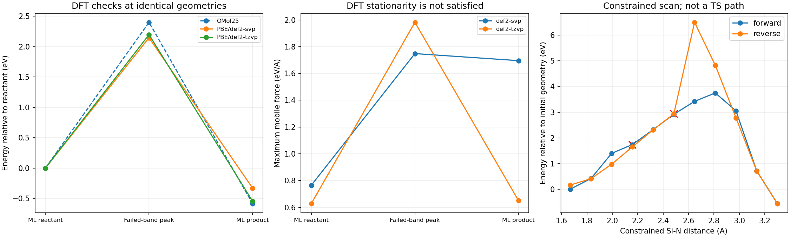

# Final Si-N cleavage: path searches and DFT diagnostics

**Target:** SiF3NH2 + HF -> SiF4 + NH3. NH3 is the nitrogen-containing removal product. This neutral-singlet molecular proxy has a fixed SiF3 frame; it is not a periodic or embedded surface and does not represent bare-N backbonds.

| Evaluation at original OMol25 geometries | Failed-band peak minus reactant (eV) | Product minus reactant (eV) | DFT maximum mobile forces: reactant / peak / product (eV/A) |
|---|---:|---:|---|
| PBE/def2-svp | 2.144 | -0.330 | 0.765 / 1.748 / 1.696 |
| PBE/def2-tzvp | 2.195 | -0.546 | 0.628 / 1.982 / 0.651 |

These fixed-geometry differences are **not activation barriers**. Density-fitted PBE uses grid level 3 and SCF tolerance 1e-9 hartree. All retained SCFs converged and passed internal orbital-stability checks; external spin stability was not tested. Nonzero DFT endpoint forces prevent a stationary-point or activation-free-energy claim.

| Path search | Peak above reactant (eV) | Maximum NEB force (eV/A) | Outcome |
|---|---:|---:|---|
| Initial FIRE band | 2.398 | 2.666 | Unconverged; not a barrier |
| BFGS continuation | 6.158 | 5.323 | Unconverged; not a barrier |

Neither peak has exactly one appreciable negative mobile-coordinate curvature. More iterations did not resolve the failure. Finite-difference energy derivatives agree with calculator forces to maximum discrepancy 0.0027 eV/A across the three original geometries and two displacements; consistency is not DFT accuracy.

## Changed search strategy and fixed-frame correction

The distant original NH3 endpoint mixes local chemistry with product separation. An initial two-coordinate scan also exposed a constraint-ordering defect: the bond projection moved nominally fixed Si by as much as 1.748 A. That run is explicitly [invalidated](../../data/final_cleavage/SiF3_NH2_HF/local_coordinate_scan/INVALIDATION.json) and excluded from this plot and all fixed-frame energy comparisons.

The corrected calculation enforces the fixed frame and three distances jointly: Si-N elongation, incoming H-to-N approach and incoming Si-F approach. Every step checks the original fixed coordinates. Analytic force projection is tested for tangency and virtual-work preservation. No atom masses are altered.

Every saved energy is evaluated with OMol25; none is interpolated. 20/22 points pass the projected-force tolerance of 0.04 eV/A. Red crosses mark failures. Physical forces before projection are retained separately. The local product-side Si-F target is 1.600 A. This scan supplies candidate geometries and a hysteresis diagnostic, not a minimum-energy path or TS. Its imposed coordinates can conceal unstable directions and force a chosen mechanism. Unconstrained relaxation, saddle curvature and downhill connectivity remain required.

## Consequence for kMC

A3 remains open. These calculations do not repair the 13 bare-N and 8 NH2 final-cleavage blockers in the 12-cycle graph run. All new rates remain disabled. Even a qualified molecular-proxy saddle would require matched embedded-environment validation before graph transfer.

[Original atom map/path](../../data/final_cleavage/SiF3_NH2_HF/omol25/summary.json) | [Continuation](../../data/final_cleavage/SiF3_NH2_HF/omol25_bfgs/summary.json) | [DFT comparison](../../data/final_cleavage/SiF3_NH2_HF/dft_initial_path/summary.json) | [Coordinate scan](../../data/final_cleavage/SiF3_NH2_HF/fixed_frame_three_coordinate_scan/summary.json) | [Force consistency](../../data/final_cleavage/SiF3_NH2_HF/force_consistency.json).

Each method folder retains geometries, forces, optimizer logs, energies and provenance hashes. No trajectory here is labeled an IS-TS-FS animation because no TS was validated.
