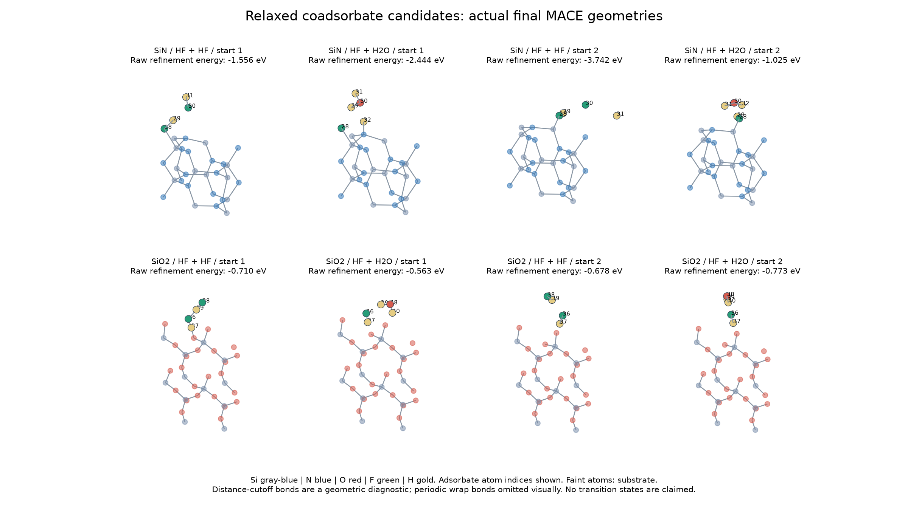
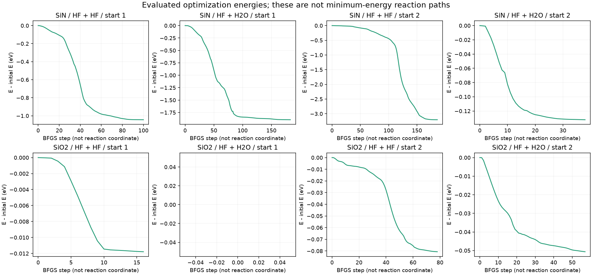

# Intermediate-gap campaign: HF coadsorbates

**8/8 local relaxations force-converged** at 0.02 eV/angstrom. These are MACE candidates addressing A1/A5, not DFT-validated intermediates, transition states or new kMC rates. Two inherited single-HF adsorption starts on each ideal nitride/oxide slab were extended with HF or H2O. All eight starts are retained, including failures.



## Original refinement results

**Use the [full mobile-coordinate follow-up](FULL_STABILITY.md) for current reference eligibility.** It includes substrate-coupled modes, additional escapes and explicitly excludes unstable parent references. The figure and table below preserve the original refinement stage, not the final stability-screened geometries.

| Surface / coadsorbate / start | Force converged | Max mobile force (eV/A) | Incremental association | Lowest adsorbate-block curvature (eV/A2) | Files |
|---|---|---:|---:|---:|---|
| SiN / HF + HF / start 1 | yes | 0.016 | -1.556 eV | +0.005 | [structure](../../data/intermediate_campaign/beta_Si3N4_001/HF_HF/start_1/refinement/final.extxyz), [energies](../../data/intermediate_campaign/beta_Si3N4_001/HF_HF/start_1/refinement/energies.csv) |
| SiN / HF + H2O / start 1 | yes | 0.016 | -2.444 eV | +0.047 | [structure](../../data/intermediate_campaign/beta_Si3N4_001/HF_H2O/start_1/refinement/final.extxyz), [energies](../../data/intermediate_campaign/beta_Si3N4_001/HF_H2O/start_1/refinement/energies.csv) |
| SiN / HF + HF / start 2 | yes | 0.019 | -3.742 eV | +0.496 | [structure](../../data/intermediate_campaign/beta_Si3N4_001/HF_HF/start_2/refinement/final.extxyz), [energies](../../data/intermediate_campaign/beta_Si3N4_001/HF_HF/start_2/refinement/energies.csv) |
| SiN / HF + H2O / start 2 | yes | 0.019 | -1.025 eV | +0.556 | [structure](../../data/intermediate_campaign/beta_Si3N4_001/HF_H2O/start_2/refinement/final.extxyz), [energies](../../data/intermediate_campaign/beta_Si3N4_001/HF_H2O/start_2/refinement/energies.csv) |
| SiO2 / HF + HF / start 1 | yes | 0.017 | -0.710 eV | +0.060 | [structure](../../data/intermediate_campaign/alpha_quartz_001/HF_HF/start_1/refinement/final.extxyz), [energies](../../data/intermediate_campaign/alpha_quartz_001/HF_HF/start_1/refinement/energies.csv) |
| SiO2 / HF + H2O / start 1 | yes | 0.017 | -0.563 eV | -0.072 | [structure](../../data/intermediate_campaign/alpha_quartz_001/HF_H2O/start_1/refinement/final.extxyz), [energies](../../data/intermediate_campaign/alpha_quartz_001/HF_H2O/start_1/refinement/energies.csv) |
| SiO2 / HF + HF / start 2 | yes | 0.018 | -0.678 eV | +0.065 | [structure](../../data/intermediate_campaign/alpha_quartz_001/HF_HF/start_2/refinement/final.extxyz), [energies](../../data/intermediate_campaign/alpha_quartz_001/HF_HF/start_2/refinement/energies.csv) |
| SiO2 / HF + H2O / start 2 | yes | 0.020 | -0.773 eV | +0.002 | [structure](../../data/intermediate_campaign/alpha_quartz_001/HF_H2O/start_2/refinement/final.extxyz), [energies](../../data/intermediate_campaign/alpha_quartz_001/HF_H2O/start_2/refinement/energies.csv) |

The energy reference is

`Delta E_add = E_relaxed(slab + HF + X) - E_relaxed(slab + HF) - E_relaxed(X_gas)`, with `X = HF or H2O`.

Each parent was re-relaxed using the same fixed lower substrate and model, then BFGS-refined to the same 0.02 eV/angstrom tolerance as the coadsorbates. Gas references use the same model and a stricter 0.01 eV/angstrom tolerance. An association energy is assigned only if all three optimizations converged. It includes any rearrangement of the original HF and mobile substrate. It is neither a cleavage barrier nor a finite-temperature adsorption free energy. A negative value alone does not establish a stable adsorbed intermediate.

Finite differences of all adsorbate forces screen the adsorbate-only Cartesian Hessian block at 0.01 angstrom displacement. Values below -0.02 eV/A2 flag appreciable negative curvature; smaller values can still represent soft instabilities or numerical error. A nonnegative block does not exclude an instability involving mobile substrate atoms. These unweighted curvatures are not vibrational frequencies. Full host-coupled Hessians are now available in the linked follow-up; cell-size checks and DFT comparison remain required.

The [candidate network](../../data/intermediate_campaign/candidate_network.json) records atom indices, actual coordinates, distance-based connectivity and changes relative to each start. Distance cutoffs are diagnostics, not electronic bond orders. No bond-cutoff graph establishes a chemical TS or an elementary mechanism.



These curves use evaluated geometries at optimization steps. Their maxima are not TS peaks; optimization trajectories are not physical time or minimum-energy reaction paths.

## Why these gaps matter: independent evidence

- [Jung et al. (2020)](https://doi.org/10.1116/1.5125569) resolve HF/HF and HF/H2O coadsorbed states on fluorinated clusters. Their ground-state barriers must be distinguished from a model adjustment for vibrationally excited HF. Sticking and desorption prefactors include fitted quantities. The [six-row extraction](../../data/intermediate_campaign/literature_coadsorbate_parameters.csv) retains source location, reference environment and transfer restrictions. Kelvin barrier parameters are converted using `E_eV = (Ea/R)_K * kB_eV/K`; no values enter our kMC library.
- [Lill et al. (2024)](https://doi.org/10.1116/6.0004019) report water-enhanced thermal HF etching of SiN and weaker AFS binding with water substitution. This motivates two competing explanations: water-assisted local reaction and water-assisted removal of retained salt. Our clean-slab coadsorbates test neither explanation completely.
- [Khumaini et al. (2024)](https://doi.org/10.1016/j.apsusc.2024.159414) use hydrogenated amorphous nitride and consider salt formation. Their material state makes transfer to an ideal crystalline slab uncertain; hydrogen content and retained products must be varied explicitly.

[Source-access records](../../data/intermediate_campaign/sources.json). The latter two source assessments use publicly accessible abstracts; no unavailable supplementary geometries were reconstructed or assumed verified.

## What is closed, and what remains open

| Gap | Progress in this campaign | Required next evidence |
|---|---|---|
| A1: precursor library | Explicit two-molecule coordinates and relaxation records on two substrates | Full minimum tests, termination and coverage ensembles, adsorption/desorption kinetics |
| A5: coadsorbates | HF/HF and HF/H2O candidates with reference-consistent incremental energies | Matched stepwise/concerted proton-transfer paths and connected TS searches |
| A2/A3: sequential/final cleavage | Existing environment-specific requests remain available | Relaxed embedded IS/FS for NH, NH2 and bare-N backbonds; qualified barriers; do not borrow one stage's barrier |
| A6: retention | Salt-removal hypothesis now distinguished from coadsorption hypothesis | Surface AFS/NH4F structures, water substitution, decomposition/desorption free energies |
| B3: material realism | Crystalline nitride/oxide comparison only | Amorphous SiNx:H ensembles, defects, multiple terminations and density/composition controls |

No gap is declared fully closed. The current kMC uses a single HF occupancy flag and cannot represent two coadsorbates faithfully. Additional occupancy states, atom accounting and qualified rates are required before these nodes can become enabled events. The [246-environment calculation queue](../../data/multilayer/rate_requests/index.json) remains separate from this screening library; these new geometries are not matches to those embedded graph environments.

## Reproduce

Use the repository MACE/ASE environment with the pinned local model:

```sh
python scripts/relax_coadsorbate_intermediates.py
python scripts/refine_coadsorbate_intermediates.py
python scripts/validate_coadsorbate_minima.py
python scripts/report_followup_validation.py --section coadsorbates
python scripts/report_coadsorbate_intermediates.py
```

[Run metadata and hashes](../../data/intermediate_campaign/refined_summary.json). Each system has its own folder with the original FIRE attempt and a separate BFGS refinement, evaluated trajectories, energy tables, final coordinates, optimizer logs and summaries. The plotted energies are the BFGS continuation, not the original starting geometry. Initial FIRE files inherit old single-HF scan metadata; use the correctly labeled refinement exports and JSON metadata for this campaign. Gas and single-HF references are retained separately. This is local CPU screening on a general materials potential, with no vibrational excitation, charge-state control, entropy or electronic-structure validation.
