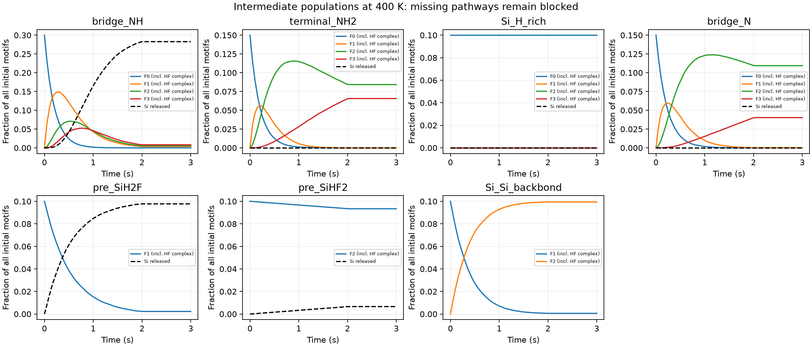

# Species-resolved HF/SiN:H kMC rerun

This rerun tracks **45 named states and 55 enabled events**, representing all 16 source HF/SiN:H pathways. It is a **conditional mechanism and prefactor sensitivity model**, not calibrated ALE or an EPC prediction. Two future removal states remain unreachable because their matching barriers are missing. The [HiPRGen pilot](../HIPRGEN.md) is a separate candidate-generation calculation; its unknown rates are not inserted here.


## Species and local environments

| Motif family | Source pathways and intermediates | Products and residuals | Restriction |
|---|---|---|---|
| NH-bridged central Si | P1c, P2c, P3c, P4; F0/F1/F2/F3 and their HF complexes | NH2 on neighboring anchors; SiF4 | Sequential connection of different source environments is assumed |
| Terminal NH2 | P1a, P2a, P3a; successive fluorination and HF complexes | NH3; remaining terminal NH2/F3 motif | Final release disabled; bridging-NH P4 is not reused |
| Bare-N bridges | P1d, P2d, P3d; N gains H as central Si gains F | Fluorinated Si and NH-bearing anchors | Matching final release absent; F3 branch blocked |
| Si-H-rich | P1b, P2b, P3b, P4 | H2; NH2 residual and SiF4 after the full sequence | High first barrier suppresses this branch in the shown conditions |
| Pre-SiH2F / pre-SiHF2 | P2e / P3e with explicit HF complex | SiH2F2 / SiHF3 and NH residual | Initial populations assumed; formation yields not predicted |
| Si-Si backbond at F1 | P2f | SiF2-bearing motif and H on neighboring Si | Subsequent connectivity and removal are missing |

Each available center can form an HF precursor complex and lose HF by desorption. Named gas accounting includes HF consumption/desorption, H2, NH3, SiF4, SiH2F2 and SiHF3. Untracked neighboring substrate anchors remain unchanged. State compositions describe the affected local inventory, not standalone molecules or an inferred bulk Si:N ratio.

HF dimers/H2O assistance, adsorbed NH3, NH4F/AFS retention, fluorocarbon films, radicals/ions, lateral hopping and reconstruction remain [intermediate/rate gaps](../../data/reaction_network/intermediate_gaps.csv). There is no new-layer refill: this is one exposure/purge calculation on an initial motif inventory.

## Rates and assumptions

The activation energies come from the [16-path factual extract](../../data/literature/sin_hf_pathways.csv), attributed to [Khumaini et al.](https://doi.org/10.1016/j.apsusc.2024.159414) and its linked public poster. The source concerns amorphous hydrogenated Si-rich nitride, not the ideal crystalline MACE slab. Ea/Ephy reference conventions and vibrational prefactors remain unresolved. Applying Ea in this conditional law is an explicit assumption:

$$k_{chem,j}=\nu\exp[-E_{a,j}/(k_BT)],\qquad a_e=N_{source(e)}k_e.$$

We assume **nu = 1e12 s^-1**, **HF arrival = 5 s^-1 per available motif**, and **precursor desorption = 100 s^-1**. Arrival stops after 2 s; reaction/desorption continue for a 1 s purge. Arrival/desorption are not pressure-calibrated or derived from physisorption energies. Products enter an irreversible dilute sink; reverse chemistry and retention are not parameterized.

Missing reaction barriers cannot acquire rates through the rate constructor. Unparameterized candidates stay outside the enabled list. **Neither unconverged MACE/OMol25 maxima nor rigid approach extrema enter this kMC rate table.**

The Gillespie sampler uses a0 = sum(a_e), waiting time -ln(u1)/a0, and event probabilities a_e/a0. Events crossing the exposure/purge boundary are resampled with the new hazards. Every event preserves the active-center count and the explicit Si/N/H/F ledger, including signed gas-reservoir flows.

An independent master-equation solution is the numerical reference:

$$\dot{\mathbf n}=Q(t)\mathbf n,\qquad \dot{\mathbf g}=C(t)\mathbf n.$$

Q evolves surface-state populations and C accumulates gas flows. Python and C++ random generators differ, so their distributions are compared statistically.

## Results and animations




The ensemble uses 1,000 initial motifs and 128 replicates per temperature. The assumed mixture is 30% NH bridges, 15% terminal NH2, 15% bare-N bridges, 10% Si-H-rich, 10% pre-SiH2F, 10% pre-SiHF2 and 10% Si-Si motifs. This is not a measured surface population. Blocked and slow branches limit conversion; the ceiling must not be interpreted as measured etch selectivity.

NH3 comes from terminal ligands; NH-bridge cleavage instead leaves NH2 on neighboring surface anchors. H2 was zero in the recorded ensembles under these conditions, although its high-barrier events are present. Gas production and retained surface populations are separate outputs. No thickness or EPC conversion is made.

[All populations](species_populations.csv) | [Every event rate and source ID](event_rates.csv) | [Event counts](event_counts_400K.csv) | [Prefactor/desorption sensitivity](assumption_sensitivity.csv) | [Machine-readable network](../../configs/species_kmc_network.json).


Each cell is one modeled reactive center on a **schematic motif grid**, not an atomistic crystal. Lowered points denote a Si-removal state, not a physical height in nm. Every frame is an actual kMC snapshot; there are no interpolated frames. [Saved trajectory](lattice_trajectory.npz), [frame manifest](animation_manifest.json).

## Reproduction

```sh
python scripts/build_species_cpp.py
python scripts/run_species_kmc.py
python scripts/plot_reaction_networks.py
python scripts/report_species_kmc.py
```

Implementations: [Python](../../plasma_surface/species_kmc.py), [C++17](../../cpp/species.cpp), [native adapter](../../plasma_surface/species_native.py). This extends the original two-state demonstration. General paired-site events, diffusion and ion impacts require additional event handling and data.

<!-- RESULTS -->

## Computed conditional values

| T (K) | Si released / initial motif | SiF4 | SiH2F2 | SiHF3 | NH3 |
|---|---:|---:|---:|---:|---:|
| 325 | 0.0041 | 0.0015 | 0.0026 | 0.0000 | 0.2781 |
| 350 | 0.0567 | 0.0379 | 0.0187 | 0.0001 | 0.3012 |
| 400 | 0.3871 | 0.2827 | 0.0977 | 0.0066 | 0.3655 |
| 450 | 0.4724 | 0.2961 | 0.1000 | 0.0763 | 0.4473 |

## Numerical verification

- All sampled Si/N/H/F balances and active-center counts are conserved exactly.
- Maximum ensemble discrepancy from the master equation: 4.93 estimated standard errors; acceptance threshold 6.
- Independent Python/C++ ensembles: maximum 1.93 estimated standard errors in the checked populated states.

Five-trial CPU timings below are a local microbenchmark. Random streams differ; event throughput accounts for differing event counts. Concurrent atomistic workloads may affect timings.

| Backend | Median seconds / 1,000-motif run | Events per second |
|---|---:|---:|
| python | 0.259281 | 51220 |
| cpp | 0.001882 | 6900177 |

[Full verification, seeds and source hashes](summary.json) | [Compiler manifest](cpp_build.json).
